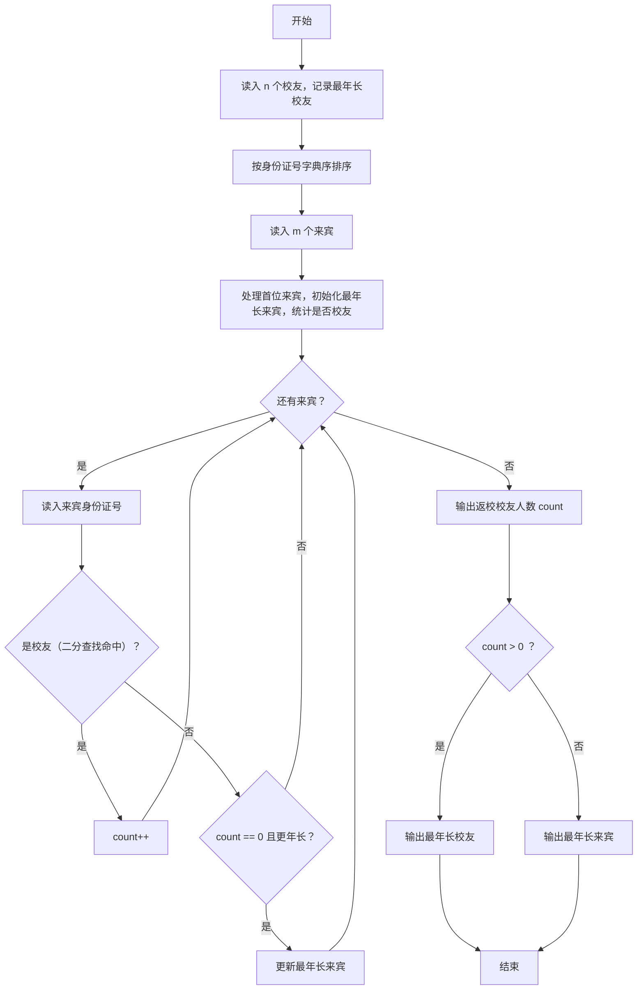
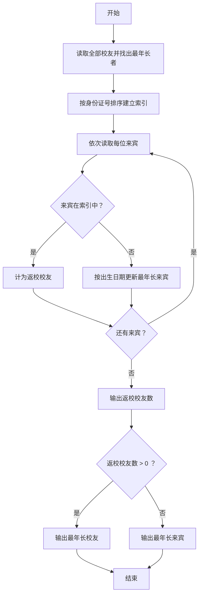

# 1100 校庆 详解

### 解题思路
- 有两组人：校友（n 个身份证号）与来宾（m 个身份证号）。身份证号第 7~14 位是出生日期 YYYYMMDD，字符串字典序越小出生越早、越年长。
- 统计返校校友人数：来宾身份用 `bsearch` 在排序后的校友数组中二分查找判定，O(log n) 一次。
- 最年长校友：在读入校友时顺带维护——比较 `alumni[i]+6`（跳过前 6 位）与当前最年长者 `+6` 的字典序，更小则更新。
- 最年长来宾：只有当返校校友数为 0 时才需要输出；代码用 `count == 0` 作为条件，在确认来宾不是校友时更新最年长来宾。
- 输出：第一行返校校友数；若有校友返校输出最年长校友身份证号，否则输出最年长来宾身份证号。
- 复杂度：排序 O(n log n)，查询 m 次二分 O(m log n)。

### 代码流程说明
- 读入校友人数 `n`，边读边把身份证存入 `alumni`，并比较第 7 位起的出生日期维护 `oldest_alumni`。
- `qsort` 对 `alumni` 按字典序排序（`cmp` 直接 `strcmp`）。
- 读入来宾人数 `m`；先读第一个来宾并初始化 `oldest_visitor`，用 `bsearch` 判断是否校友，是则 `count++`。
- 循环读其余 m-1 个来宾：是校友则 `count++`；否则若 `count == 0` 且出生日期更早则更新 `oldest_visitor`。
- 输出 `count`，再按 `count > 0` 与否输出 `oldest_alumni` 或 `oldest_visitor`。

### 代码流程图

### 解题流程图

