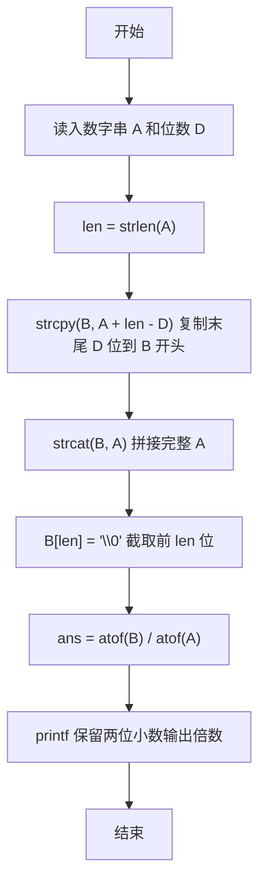
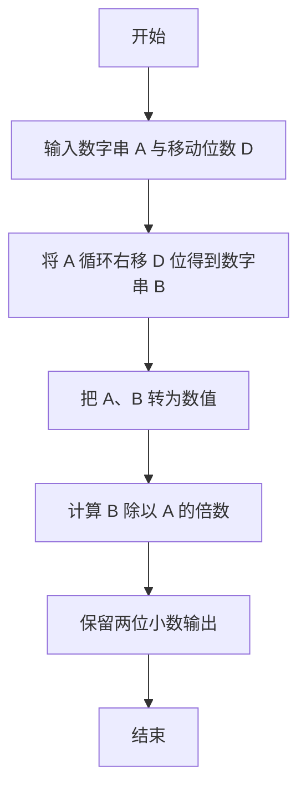

# 1101 B是A的多少倍 详解

### 解题思路

- 本题的本质是"数字串循环右移"：把数字串 A 的最后 D 个字符搬到最前面，得到新数字串 B，再求数值 B 与 A 的比值。
- 循环移位不需要真正按位搬移字符：先把 A 的末尾 D 个字符复制到 B 的开头，再把完整的 A 拼接到 B 后面，最后截取前 len 个字符即可得到移位结果，巧妙地避开了复杂的下标运算。
- 由于 A 可能很大（题目给出的一定是普通整数范围），这里直接用 `atof` 将字符串转为浮点数参与除法，省去手写大数除法。
- 输出要求保留两位小数，直接用 `printf("%.2f")` 完成格式化。
- 时间复杂度 O(len)，仅与数字串长度有关，空间开销 O(len)。

### 代码流程说明

1. 程序先用 `scanf("%s %d", A, &D)` 读入数字串 A 和移动位数 D，并用 `strlen(A)` 得到长度 len。
2. 用 `strcpy(B, A + len - D)` 把 A 末尾 D 个字符复制到 B 的开头；再 `strcat(B, A)` 把完整的 A 接在 B 后面，此时 B 的长度为 len + D，其中前 len 个字符正是"循环右移 D 位"的结果。
3. 用 `B[len] = '\0'` 把 B 截断为 len 位，得到最终的移位数字串 B。
4. 用 `atof(B) / atof(A)` 把两个数字串转成浮点数并求倍数，存入 ans。
5. 用 `printf("%.2f\n", ans)` 输出结果，保留两位小数。

### 代码流程图

### 解题流程图

