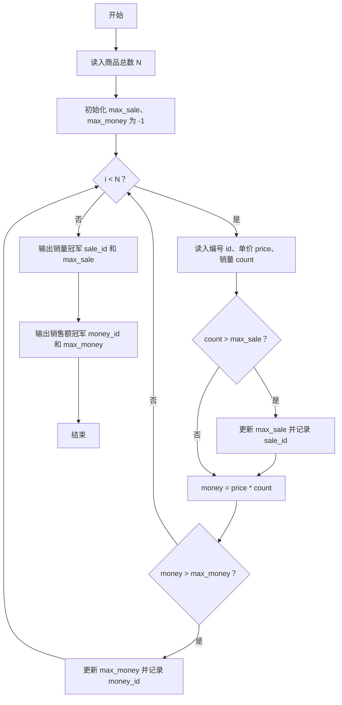
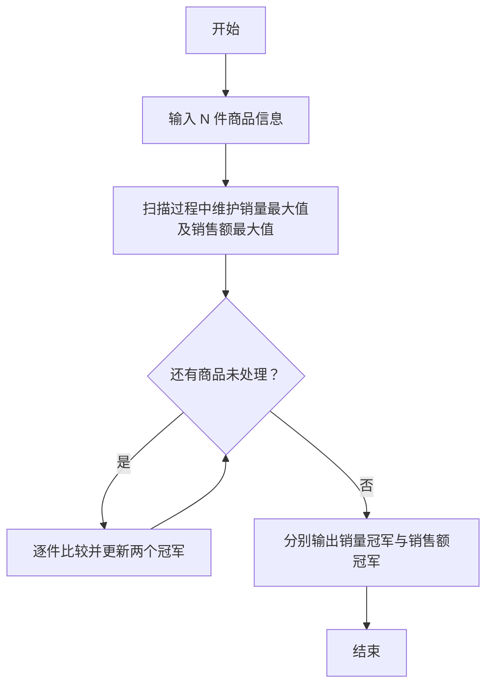

# 1102 教超冠军卷 详解

### 解题思路

- 题目要求在 N 件商品中分别找出"销量最高"和"销售额最高"的商品，本质是两次"最大值"统计。
- 无需存储全部商品：只需维护两个当前最优值（销量 max_sale、销售额 max_money）以及对应的商品编号，边读入边更新，空间复杂度 O(1)。
- 销售额需按"单价 × 销量"实时计算后参与比较，注意与销量冠军的更新是相互独立的两个过程。
- 编号用字符串保存，更新最大值时用 `strcpy` 拷贝即可。
- 时间复杂度 O(N)，只需一趟扫描。

### 代码流程说明

1. 程序首先读入商品总数 N，并初始化记录变量：sale_id、money_id 分别存放销量冠军与销售额冠军的编号，max_sale、max_money 初始为 -1（保证任意合法输入都能更新）。
2. 进入 for 循环逐一读入每个商品的编号 id、单价 price 和销量 count。
3. 先判断 `count > max_sale` 是否成立：成立则更新 max_sale 并把 id 复制到 sale_id，完成销量冠军的维护。
4. 再计算该商品销售额 `money = price * count`，若 `money > max_money` 则更新 max_money 与 money_id，完成销售额冠军的维护。
5. 循环结束后，先输出销量冠军 `sale_id max_sale`，再输出销售额冠军 `money_id max_money`。

### 代码流程图

### 解题流程图

