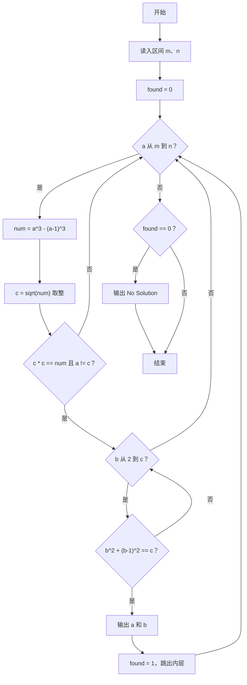
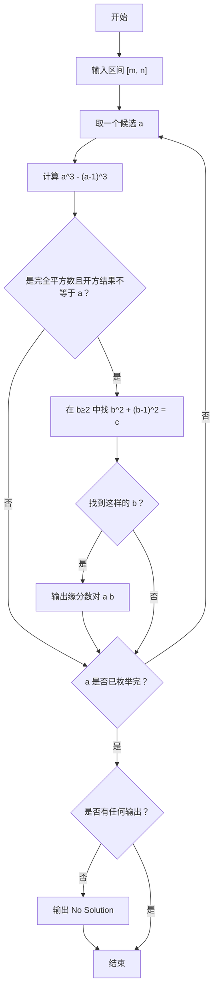

# 1103 缘分数 详解

### 解题思路

- 题目定义缘分数对 (a, b) 需同时满足：a³ − (a−1)³ 是完全平方数 c²（且 c ≠ a），并且 c 恰好等于 b² + (b−1)²（b ≥ 2）。
- 外层直接枚举区间 [m, n] 内的每个 a，把"枚举 + 判定"合为一体，无需预生成。
- 判定完全平方数：对 num = a³ − (a−1)³ 先开方取整得到 c，再验证 `c * c == num`，可避免浮点误差带来的误判。
- 因为 a³ − (a−1)³ 可达 3a² 量级，中间计算必须使用 long long 防止溢出，比较时同样用 long long 对齐。
- 内层枚举 b 从 2 到 c，检查 b² + (b−1)² 是否等于 c，找到第一组即输出；全部没找到则输出 "No Solution"。
- 时间复杂度约为 O((n−m) × c)，由于 b 枚举上限即 c 本身，实际可行范围内开销可接受。

### 代码流程说明

1. 读入区间端点 m、n，并置 found 为 0 表示尚未找到缘分数对。
2. 外层 for 循环让 a 从 m 递增到 n。
3. 对每个 a，用 long long 计算 `num = a^3 - (a-1)^3`，再 `c = (int)sqrt(num)` 试探开方。
4. 若 `c * c == num` 且 `a != c`，说明该 a 对应一个整数平方根 c，进入内层循环：让 b 从 2 递增到 c，判断 `b*b + (b-1)*(b-1) == c` 是否成立。
5. 成立则按格式输出 `a b`，置 found 为 1 并 break 跳出内层循环；不成立则继续下一个 a。
6. 外层结束后若 found 仍为 0，输出 "No Solution"。

### 代码流程图

### 解题流程图

