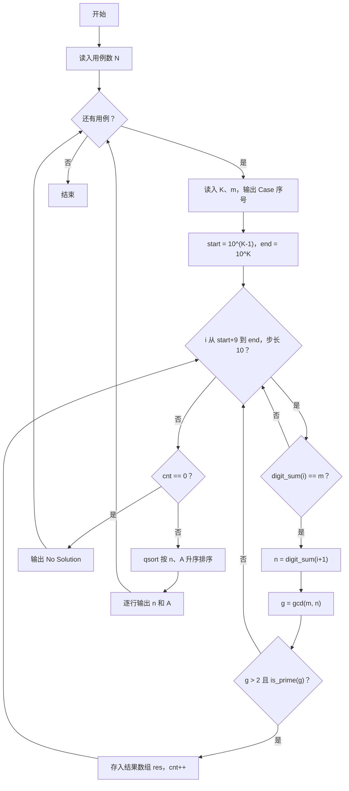
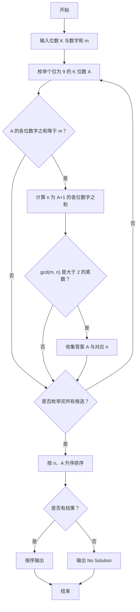

# 1104 天长地久 详解

### 解题思路

- 要找 K 位"天长地久"数 A，条件为：A 的个位是 9、A 的各位数字之和等于 m，且 A+1 的各位数字之和 n 与 m 的最大公约数是一个大于 2 的素数。
- 关键优化一：A 的个位固定为 9，所以只需遍历 `start + 9, start + 19, ...` 这类步长为 10 的 K 位数，把枚举规模缩小到原来的 1/10。
- 关键优化二：由于个位为 9，A+1 会触发末尾一连串 9 进位，其各位数字之和 n 可以直接通过 `digit_sum(A+1)` 计算，无需单独推导规律。
- 用三个小工具函数分工：`gcd`（欧几里得算法求最大公约数）、`is_prime`（试除法判素数）、`digit_sum`（逐位求和），使主流程清晰。
- 筛选到的结果先存入结构体数组，再用 `qsort` 按 n 升序、A 升序排列后输出，保证输出顺序符合题目要求。
- 时间复杂度与 K 位数总量有关：需要检查约 10^(K−1) / 10 个候选数，每个候选的判定代价为 O(K) 级，K 较大时耗时较长，但符合题给数据规模。

### 代码流程说明

1. 读入测试用例数 N，外层 for 循环依次处理每个用例。
2. 每个用例读入 K 和 m，输出 "Case 序号" 行，并初始化结果数组 res 和计数器 cnt。
3. 计算 K 位数的范围：start = 10^(K−1)，end = start × 10。
4. for 循环从 `start + 9` 开始、每次加 10，只枚举个位为 9 的 K 位数 i。
5. 先检查 `digit_sum(i) == m`；满足后再算 `n = digit_sum(i + 1)` 与 `g = gcd(m, n)`。
6. 若 `g > 2` 且 `is_prime(g)` 为真，把 n 和 i 存入 res 数组，cnt 加一。
7. 枚举结束后：若 cnt 为 0 输出 "No Solution"；否则 `qsort` 排序后逐行输出 `n A`。

### 代码流程图

### 解题流程图

