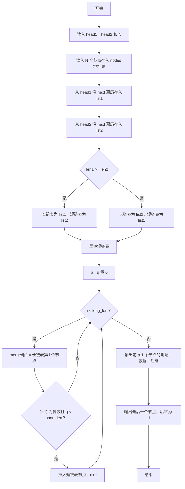
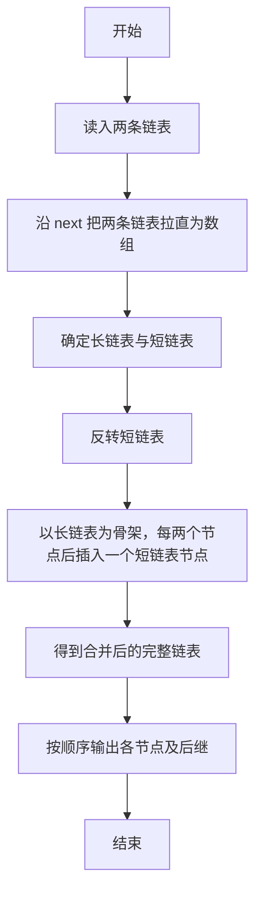

# 1105 链表合并 详解

### 解题思路

- 题目给出两个地址式链表，要求把较短的一条反转后，间隔插入较长链表的第 2、4、6……个节点之后，形成新链表。
- 由于地址范围有限（5 位数字），采用"数组模拟链表"：`nodes[addr]` 直接以地址为下标存放节点，查找节点代价为 O(1)，避免动态指针的繁琐。
- 第一步先把两条链表分别沿 next 链拉直成顺序数组 list1、list2，并同时得到长度 len1、len2，方便判断长短与做后续操作。
- 反转短链表只需对前 short_len/2 对元素做对称交换，即可得到逆序。
- 合并时同时维护两个下标：p 指向合并结果数组 merged，q 指向短链表；每当在长链表中输出完第偶数个节点（`(i+1) % 2 == 0`）就插入一个短链表节点，直到短链表用完。
- 最后统一修正 next 指向：第 p−1 个节点的后继为 -1，其余节点的后继即下一个节点地址，直接按数组顺序输出即可。
- 时间复杂度 O(N)，空间复杂度 O(N)。

### 代码流程说明

1. 读入两条链表的头地址 head1、head2 与节点总数 N；随后 N 次读入每个节点的地址、数据、后继地址，存入以地址为下标的全局数组 nodes。
2. 从 head1 开始沿 next 依次把节点存入 list1（len1 计数），直到遇到 "-1"；同样方式把 head2 链表存入 list2。
3. 比较 len1 与 len2，确定长链表指针 long_list 与短链表指针 short_list。
4. 对 short_list 前 short_len/2 对元素做交换，完成短链表反转。
5. 合并：for 循环遍历长链表每个节点，先放入 merged 的 p 位置，若已放入的个数为偶数且短链表还有剩余（q < short_len），则把 short_list[q] 插入 merged，q 自增。
6. 输出合并结果：前 p−1 个节点输出"地址 数据 下一个地址"，最后一个节点输出"地址 数据 -1"。

### 代码流程图

### 解题流程图

