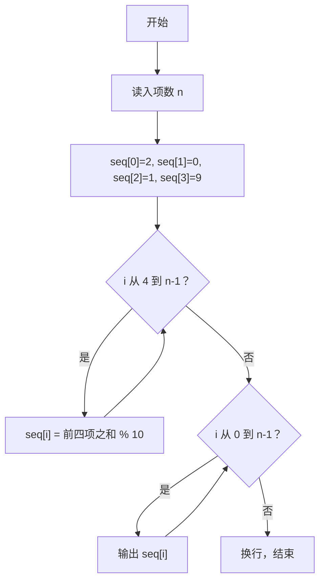
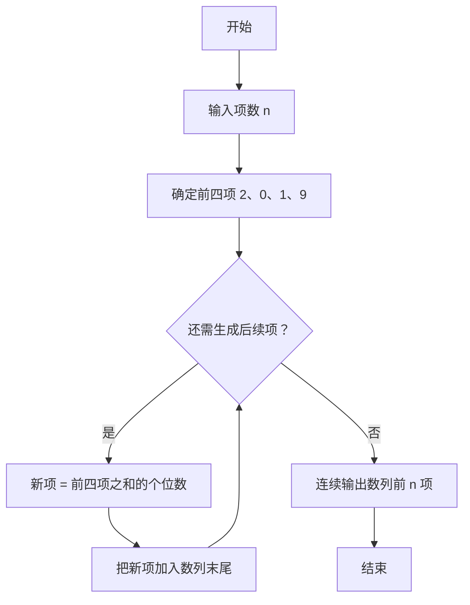

# 1106 2019数列 详解

### 解题思路

- 题目要求按规则构造一个数列：前 4 项固定为 2、0、1、9，从第 5 项开始，每一项等于前 4 项之和的个位数。
- 这是典型的"递推生成"问题：用数组 seq 顺序保存每一项，递推公式为 `seq[i] = (seq[i-1] + seq[i-2] + seq[i-3] + seq[i-4]) % 10`。
- 取个位数只需对 10 取模，因为前 4 项之和不超过 36，结果也必然是一位数。
- 输出时不加分隔符、直接连续打印每一位数字，恰好构成题目要求的数字串。
- 时间复杂度 O(n)，空间复杂度 O(n)。

### 代码流程说明

1. 程序先读入项数 n。
2. 初始化 seq[0] = 2、seq[1] = 0、seq[2] = 1、seq[3] = 9 作为数列前 4 项。
3. for 循环从 i = 4 开始到 i < n：计算 `seq[i] = (seq[i-1] + seq[i-2] + seq[i-3] + seq[i-4]) % 10`，即前四项之和取个位。
4. 循环结束后，用第二个 for 循环从 0 到 n−1 连续打印 seq[i]，最后换行。

### 代码流程图

### 解题流程图

