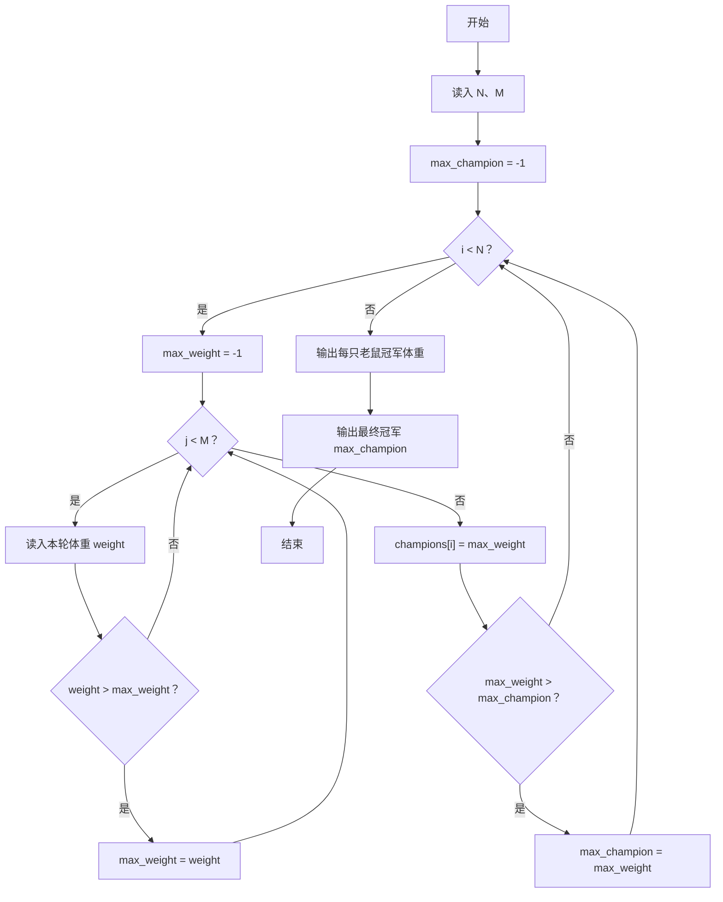
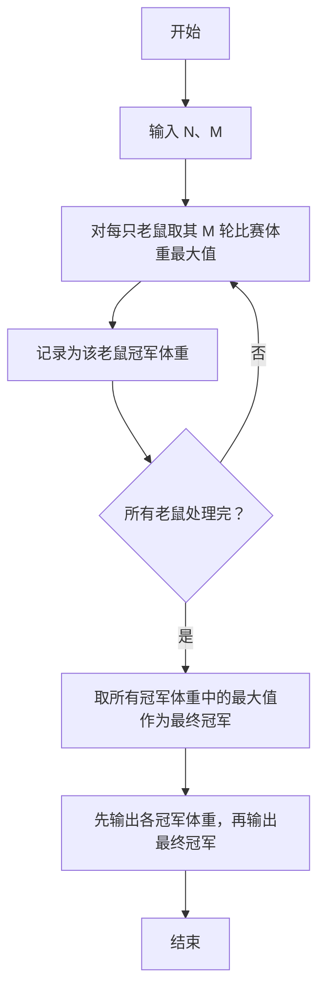

# 1107 老鼠爱大米 详解

### 解题思路

- 题目背景：N 只老鼠各参加 M 轮比赛，每轮体重最大的成为"轮冠军"；每只老鼠在 M 轮中的最大体重是它的"冠军体重"；最终冠军是所有老鼠冠军体重中的最大值。
- 数据组织方式：champions 数组按编号保存每只老鼠的冠军体重；max_champion 变量记录全局最大值。
- 核心技巧是"双指针式滚动比较"：读入每轮体重时同时维护"当前老鼠的最大值"和"全局最大值"，一趟扫描完成所有统计。
- 每只老鼠的 M 个值无需全部保存，读入即比较，节省存储。
- 输出时先按顺序输出每只老鼠的冠军体重（空格分隔），换行后再输出最终冠军体重。
- 时间复杂度 O(N×M)，空间复杂度 O(N)。

### 代码流程说明

1. 读入 N 和 M，并初始化 max_champion = -1。
2. 外层 for 循环处理每只老鼠：置 max_weight = -1，内层 for 循环读入该老鼠 M 轮的体重 weight，只要 `weight > max_weight` 就更新 max_weight。
3. 内层结束后把 max_weight 存入 champions[i]，并检查是否大于 max_champion，是则更新最终冠军。
4. 所有老鼠处理完后，for 循环输出 champions[0..N-1]，除第一个外每个数字前打印一个空格。
5. 换行后输出 max_champion，即最终冠军体重。

### 代码流程图

### 解题流程图

