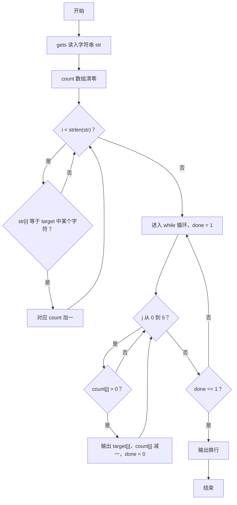
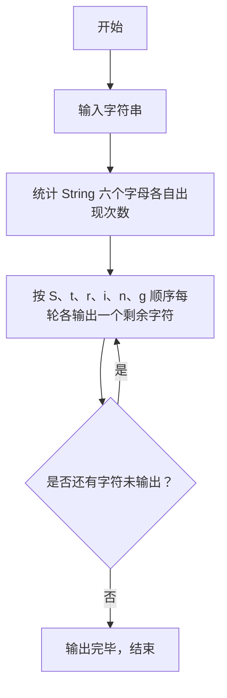

# 1108 String复读机 详解

### 解题思路

- 题目要求把输入字符串中属于 "String" 这 6 个字母的字符提取出来，按 "S t r i n g" 的顺序循环输出，每轮各输出一个仍在计数的字符，直到全部输出完毕。
- 数据组织：用长度 6 的 count 数组统计 'S'、't'、'r'、'i'、'n'、'g' 六个目标字符各出现多少次，target 数组保存 "String" 的六个字母。
- 统计阶段对输入串每个字符逐一与 6 个目标字符比对，命中则对应计数加一（非目标字符直接忽略）。
- 输出阶段采用"轮询"思想：while 循环里每轮按顺序扫描 count[0..5]，凡计数大于 0 的字符输出一个并减一；用 done 标记本轮是否一个字符都没输出，若是则说明全部输出完毕，循环结束。
- 输出结果不需要空格，字符直接相连成串，最后换行。
- 时间复杂度 O(len × 6)，len 为输入串长度。

### 代码流程说明

1. 用 `gets(str)` 读入整个字符串，初始化 count 数组全 0，target 设为 "String"。
2. 统计：for 循环遍历 str 的每个字符，内层 for 与 target 的 6 个字符比对，命中则 count[j]++ 并跳出内层。
3. 输出：进入 while(1) 循环，每轮先把 done 置 1；再 for 扫描 count[0..5]，若 count[i] > 0 则打印 target[i] 并 count[i]--，同时置 done = 0。
4. 若本轮 done 仍为 1（所有计数已为 0），break 退出循环；最后打印换行符。

### 代码流程图

### 解题流程图

