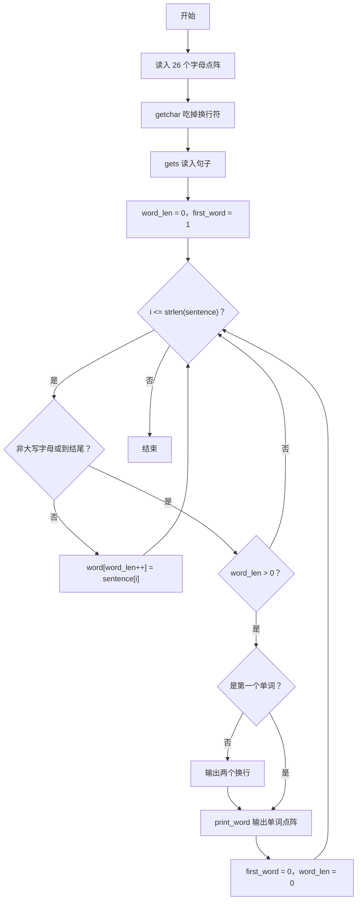
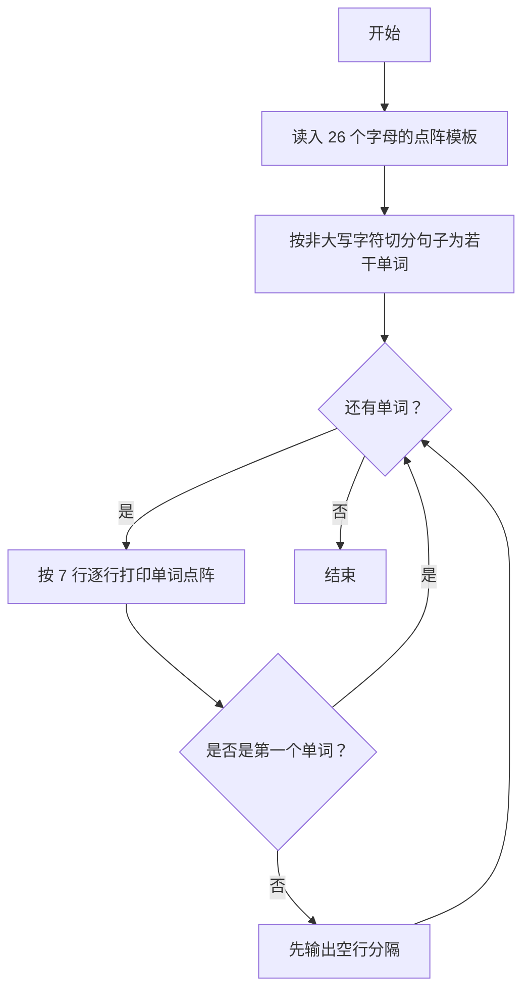

# 1109 擅长C 详解

### 解题思路

- 题目要求用 7×5 的点阵字形打印输入句子中的大写字母，句子以空格等非大写字符切分为单词，单词之间以空行分隔，同一单词内字母之间以空格分隔。
- 数据组织：三维字符数组 letters[26][7][6] 存放 26 个大写字母的点阵，每个字母 7 行、每行 5 个字符（字符串存储，含结尾符所以第 6 维为 6）。
- 打印单词时采用"按行拼接"策略：外层循环 7 行，内层循环单词中的每个字母，输出该字母点阵的第 i 行，字母间补一个空格——这样天然保证各字母同一行对齐。
- 句子切分：遍历句子，遇到非大写字母或字符串结尾即认为一个单词结束；只用大写字母组成单词，其余字符（空格、标点）充当分隔符。
- 用 first_word 标记判断是否为第一个单词：从第二个单词起，每个单词输出前先打印两个换行符实现空行分隔。
- 时间复杂度 O(句子长度 × 单词字母数 × 7)，空间开销固定为 26 个字母的点阵。

### 代码流程说明

1. 程序先把 26 个大写字母的点阵逐行读入 letters[i][j]，随后用 getchar() 吃掉点阵数据后的换行符。
2. 用 `gets(sentence)` 读入待显示的句子。
3. 初始化 word 缓冲、word_len = 0 与 first_word = 1。
4. 遍历 sentence 的每个字符：若当前字符不是大写字母（或已到结尾），说明一个单词收集完毕；若 word_len > 0，则在 word[word_len] 处置 '\0'，若不是第一个单词先输出 "\n\n"，再调用 print_word(word) 输出点阵，之后把 first_word 置 0、word_len 清零。
5. 若当前字符是大写字母，则存入 word[word_len++]。
6. print_word 函数内：对行 i 从 0 到 6，遍历单词各字母 j，打印 letters[word[j]-'A'][i]，除最后一个字母外补一个空格，每行末尾换行。

### 代码流程图

### 解题流程图

