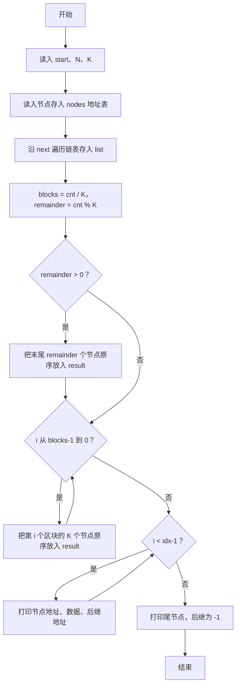
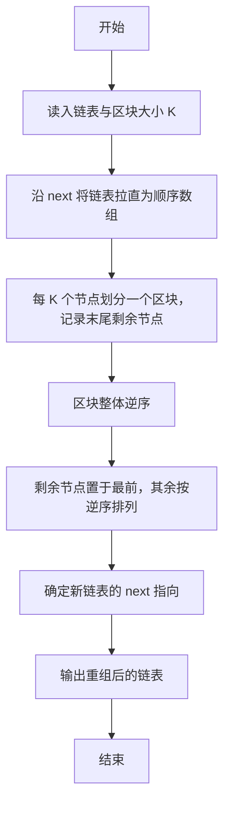

# 1110 区块反转 详解

### 解题思路

- 题目要求把链表按每 K 个节点划分区块，将各区块整体逆序（最后一个区块放到最前面），但每个区块内部节点保持原序；末尾不足 K 个的节点自成一组，逆序后应位于新链表最前。
- 采用"数组模拟链表"：nodes[addr] 以地址为下标存放节点，沿 next 遍历即可把整条链表拉直成顺序数组 list，同时得到真实长度 cnt（注意输入可能含无效节点，以实际链长为准）。
- 区块划分：blocks = cnt / K 为完整区块数，remainder = cnt % K 为末尾剩余节点数。
- 重组规则：先取出末尾 remainder 个节点（保持原序）放到结果数组最前，再从最后一个完整区块开始、逆序把每个区块的 K 个节点依次放入结果数组。
- 输出时地址用 %05d 补齐 5 位，前 idx−1 个节点的后继为下一个节点的地址，最后一个节点的后继为 -1。
- 时间复杂度 O(N)，空间复杂度 O(N)。

### 代码流程说明

1. 读入头节点地址 start、节点总数 N 与区块大小 K。
2. N 次读入每个节点的地址、数据、后继地址存入 nodes 数组。
3. 从 start 出发，沿 next 遍历：每访问一个节点就放入 list 数组并 cnt 自增，直到 cur 为 -1，得到按原顺序排列的链表。
4. 初始化结果数组 result 与下标 idx = 0；计算 blocks 与 remainder。
5. 若 remainder > 0，把 list 中最后 remainder 个节点（原序）依次拷入 result，即反转后位于链表最前的部分。
6. for 循环 i 从 blocks−1 递减到 0：内层 j 从 0 到 K−1，把第 i 个区块的节点 list[i*K+j] 拷入 result。
7. 输出：前 idx−1 个节点按"地址 数据 下一地址"打印，最后一个节点打印"地址 数据 -1"。

### 代码流程图

### 解题流程图

