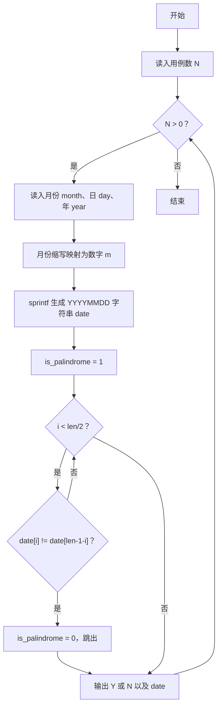
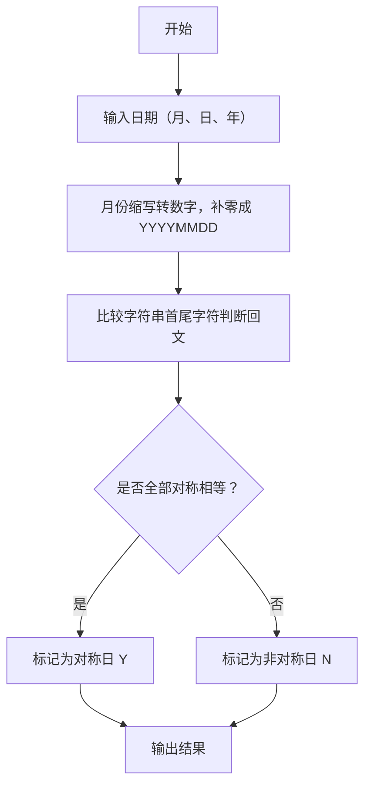

# 1111 对称日 详解

### 解题思路

- 题目要求判断给定日期是否为"对称日"，即把日期整理成"年月日"形式后字符串正读反读相同（回文）。
- 输入格式为 "月份英文缩写 日, 年"，第一步需把月份缩写（Jan~Dec）映射为数字 1~12。
- 用 `sprintf(date, "%04d%02d%02d", year, m, day)` 统一格式化为 8 位 YYYYMMDD 字符串，月、日自动补零，便于直接做回文判断。
- 回文判定：双指针式首尾比较，比较前 len/2 个字符与其对称位置即可，有一处不等即非回文。
- 输出时输出 'Y' 或 'N' 以及格式化后的日期字符串。
- 时间复杂度 O(N × L)，L 为日期字符串长度（固定约 8），开销极小。

### 代码流程说明

1. 读入测试用例个数 N，进入 while(N--) 循环逐个处理。
2. 每个用例用 `scanf("%s %d, %d", month, &day, &year)` 读入月份缩写、日、年。
3. 通过一长串 strcmp 判断将 month 映射为数字 m（Jan=1 … Dec=12）。
4. 用 sprintf 拼出 "YYYYMMDD" 格式的 date 字符串，取长度 len。
5. 初始化 is_palindrome = 1，for 循环比较 date[i] 与 date[len-1-i]，不等则置 0 并跳出。
6. 按 `printf("%c %s\n", ...)` 输出 Y/N 与 date，继续处理下一个用例。

### 代码流程图

### 解题流程图

