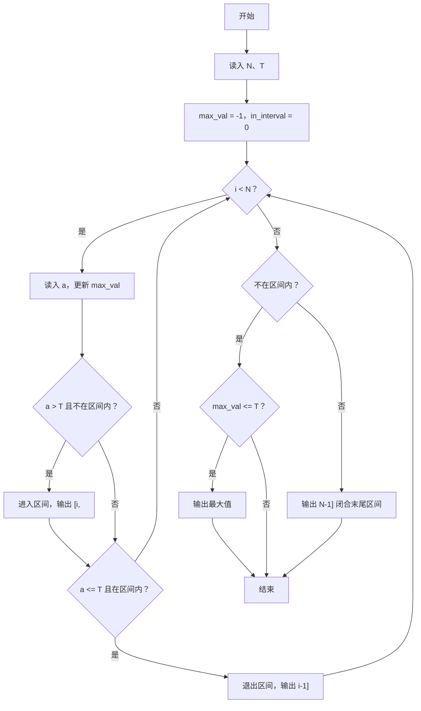
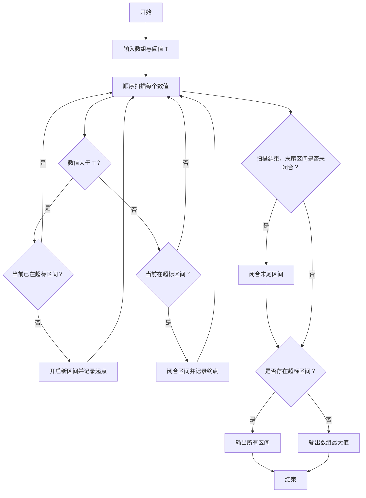

# 1112 超标区间 详解

### 解题思路

- 题目要求在一维数组里找出所有"超标区间"：连续一段数值都大于阈值 T 的区间，按 "[起始下标, 结束下标]" 输出；若不存在任何超标区间，则输出整个数组的最大值。
- 采用"在线状态机"思路：用一个布尔变量 in_interval 表示当前是否处于超标区间中，边读入边处理，无需把整个数组存下来。
- 区间开始条件：当前值 a > T 且之前不在区间内（in_interval == 0），此时输出 "[i, " 并记录起始。
- 区间结束条件：当前值 a ≤ T 且之前在区间内（in_interval == 1），此时输出 "i-1]"。
- 边界处理：若读完后 in_interval 仍为 1，说明最后一个区间延伸到了数组末尾，需补输出 "N-1]"；若从未进入任何区间（in_interval == 0 且最大值 ≤ T），则输出最大值。
- 同时维护 max_val 以应对"无超标区间"的情形。
- 时间复杂度 O(N)，空间复杂度 O(1)。

### 代码流程说明

1. 读入 N 和阈值 T，初始化 max_val = -1、in_interval = 0、start = 0。
2. for 循环从 i = 0 到 N−1：每次读入一个数 a，先更新 max_val。
3. 若 `a > T && !in_interval`：置 in_interval = 1、start = i，并立即输出 "[i, "。
4. 若 `a <= T && in_interval`：置 in_interval = 0，输出 "i-1]" 表示区间闭合。
5. 循环结束后判断：若 `!in_interval && max_val <= T`，输出 max_val（无超标区间）；否则若 `in_interval` 为真，输出 "N-1]" 闭合延伸到末尾的区间。

### 代码流程图

### 解题流程图

