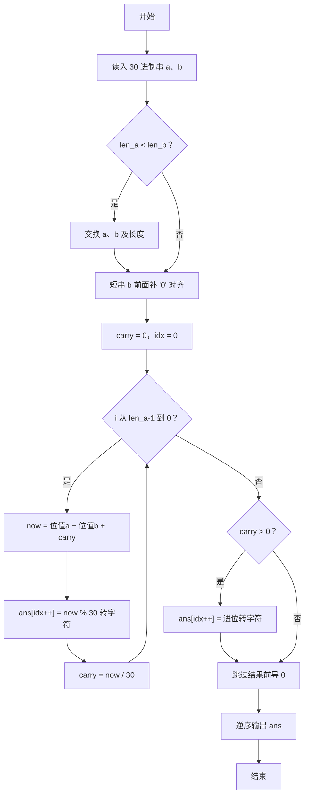
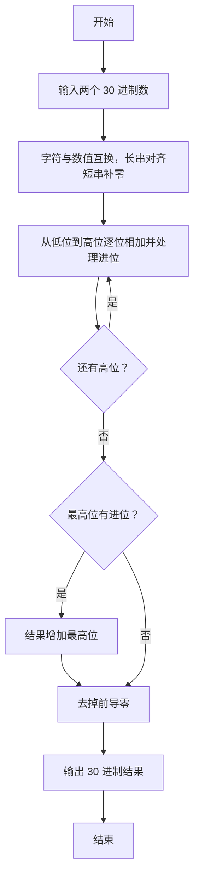

# 1113 钱串子的加法 详解

### 解题思路

- 题目要求实现 30 进制大数加法：数字 0~9 用字符 '0'~'9' 表示，10~29 用 'a'~'t' 表示。
- 用两个映射函数完成字符与数值互转：`char_to_val` 处理 '0'~'9' 和 'a'~'t'，`val_to_char` 反向转换。
- 对齐策略：交换两串使 a 为较长串，再把短串 b 前面补 '0' 使两者等长，从而可以在同一下标上逐位相加。
- 逐位相加模拟：从最低位（字符串末尾）向最高位推进，`now = 位值_a + 位值_b + 进位`，当前位写入 `now % 30`，进位更新为 `now / 30`。
- 结果 ans 是倒序存放的，处理完所有位后若仍有进位需补一位；输出前从高位往低位跳过前导 '0'（至少保留一位），再逆序打印。
- 时间复杂度 O(len_a)，空间复杂度 O(len_a)。

### 代码流程说明

1. 读入两个 30 进制数字串 a、b，取得长度 len_a、len_b。
2. 若 len_a < len_b 则交换 a、b 及长度，保证 a 是较长串。
3. 在 b 前补 '0'：for 循环里反复用 sprintf 拼出 "0" + b，直到 b 与 a 等长。
4. 初始化 carry = 0、idx = 0；for 循环从 i = len_a−1 递减到 0，逐位取 num_a、num_b，计算 now，将 `now % 30` 转为字符存入 ans[idx++]，carry = now / 30。
5. 循环结束后若 carry > 0，把进位转为字符补到 ans 末尾。
6. 从最高位起跳过前导 '0' 确定起始下标 start（保留至少一位），再逆序输出 ans 的 start..0，最后换行。

### 代码流程图

### 解题流程图

