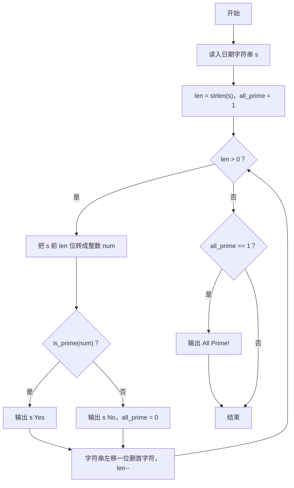
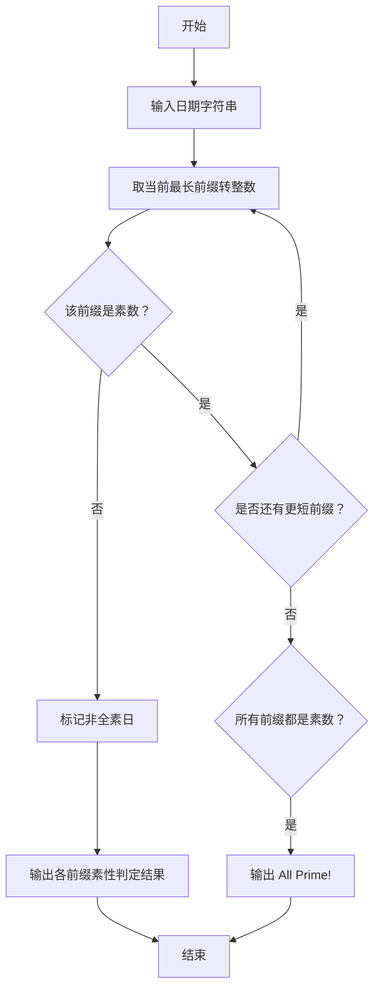

# 1114 全素日 详解

### 解题思路

- 题目要求判断一个日期是否为"全素日"：日期的每一个前缀（从最长到最短）都必须是素数。
- 前缀生成方式：先取整个日期字符串转成整数判断素数；然后删掉首字符得到更短的前缀，再判断，直到只剩 1 位。
- 素性判断用试除法：`is_prime` 对 x < 2 直接返回假，对 x ≥ 2 只需试除到 √x 即可。
- 用 all_prime 标志位记录是否所有前缀都是素数；一旦某个前缀不是素数，该日期就不是全素日。
- 每判断一个前缀就输出一行 "原日期字符串 Yes/No"，最后若全部为 Yes 则额外输出 "All Prime!"。
- 时间复杂度 O(L² + L·√(10^L)) 级别：L 为日期串长度（通常 8 位内），每个前缀转整数的代价是 O(L)，共 L 个前缀，素数判断代价较小，整体开销可接受。

### 代码流程说明

1. 读入日期字符串 s，取得长度 len，初始化 all_prime = 1。
2. while 循环以 len > 0 为条件：先用 for 循环把当前前缀（s 的前 len 个字符）转成整数 num。
3. 调用 is_prime(num) 判断：输出 "s Yes" 或 "s No"；若不是素数则 all_prime 置 0。
4. 把 s 整体左移一位（删除首字符），并在末尾补 '\0'，len 减一，继续检查下一个更短的前缀。
5. while 结束后若 all_prime 仍为 1，输出 "All Prime!"。

### 代码流程图

### 解题流程图

