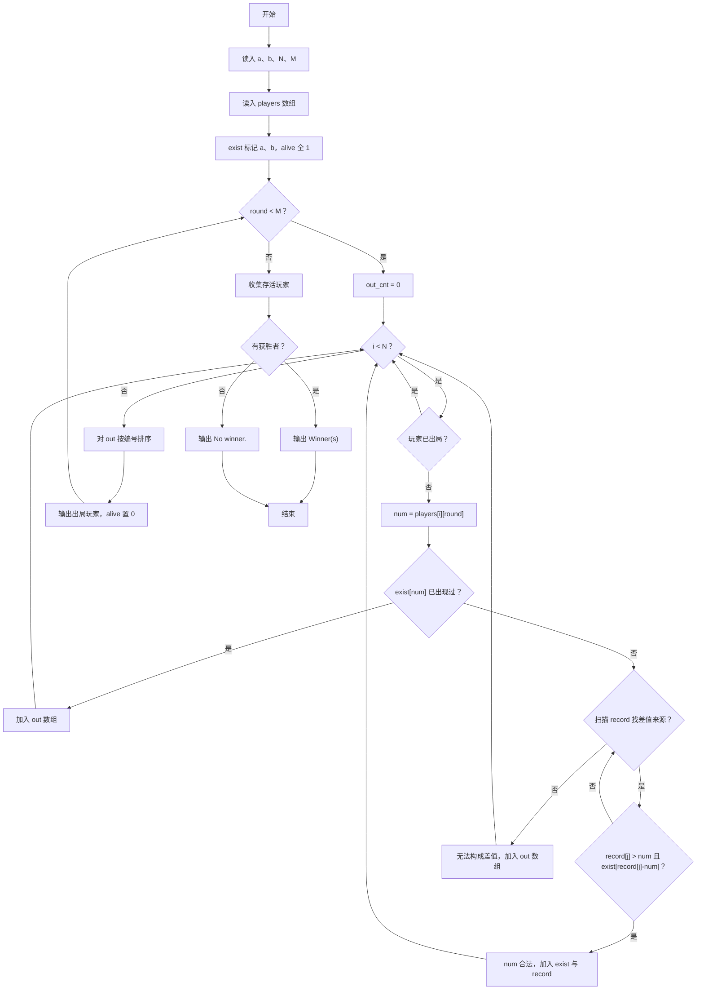
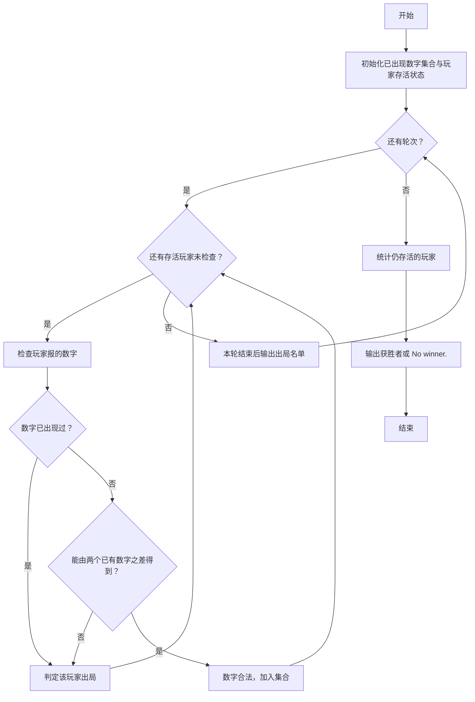

# 1115 裁判机 详解

### 解题思路

- 题目是模拟类问题：初始给出两个安全数字 a、b，之后 M 轮中每个存活玩家每轮报一个数；若该数已出现过，或不能表示为任意两个已出现数字之差，则该玩家本轮出局。
- 数据组织：`exist` 布尔数组以数字本身为下标标记"是否出现过"（数字范围有限，可开数组）；`record` 数组按出现顺序记录所有已有数字，方便差值判断；`alive` 标记各玩家是否存活。
- 差值判断技巧：新报数 num 合法当且仅当存在已有数字 x > num 使 x − num 也已在集合中，即 `exist[x - num]` 为真——这样把"枚举两两差值"优化为对 record 的线性扫描加一次 exist 查询。
- 出局玩家先暂存到 out 数组，一轮处理完统一冒泡排序（按编号升序）后输出 "Round #i: 编号 is out."，并同步把 alive 置 0，保证同轮内已出局玩家不再被检查、也不影响后续轮次判定。
- 合法数字在判定通过后立即加入 exist 与 record，供本轮后续玩家及后续轮次使用。
- 所有轮次结束后收集存活玩家输出 "Winner(s): ..."，无存活则输出 "No winner."。
- 时间复杂度：每轮每人做一次差值扫描，约为 O(M × N × rcnt)，rcnt 为已有数字个数。

### 代码流程说明

1. 读入初始安全数字 a、b 与玩家数 N、轮数 M；读入 players[i][j] 记录每个玩家每轮报的数。
2. 初始化 exist 与 record：标记 a、b 已出现并存入 record，rcnt = 2；alive 全部置 1。
3. 外层 for 循环处理每一轮：每轮先清空 out 数组（out_cnt = 0）。
4. 内层 for 遍历所有玩家：已出局（!alive[i]）则跳过；取出 num = players[i][round]。
5. 若 `exist[num]` 为真直接判定出局入 out；否则扫描 record 找是否存在 record[j] > num 且 `exist[record[j] - num]` 为真，找不到则出局，找到则把 num 加入 exist 与 record。
6. 本轮检查完毕后，用两重循环对 out 按编号升序排序，然后逐个输出出局信息并把 alive 置 0。
7. M 轮结束后扫描 alive 收集获胜玩家：无存活输出 "No winner."，否则输出 "Winner(s): 编号 ..."。

### 代码流程图

### 解题流程图

