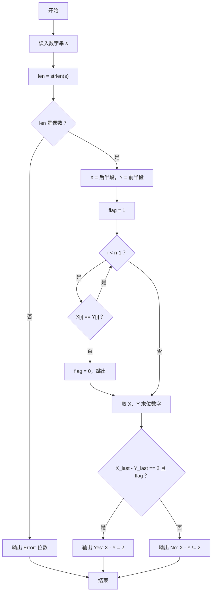
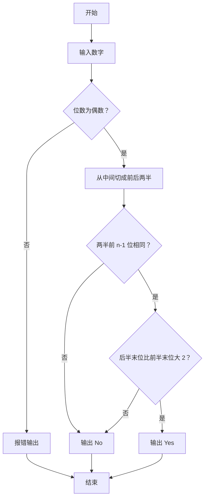

# 1116 多二了一点 详解

### 解题思路

- 题目定义"多二了一点"的数：数字位数为偶数，分成前后两半 Y（前半）和 X（后半），满足 X 的前 n−1 位与 Y 的前 n−1 位完全相同，且 X 的最后一位比 Y 的最后一位大 2。
- 用字符串读入数字便于按位比较与切片：直接令指针 X 指向字符串后半段、Y 指向字符串前半段，无需拷贝。
- 先校验位数：`len % 2 != 0` 时输出 "Error: %d digit(s)" 并直接结束。
- 核心判定分两步：for 循环比对 X 与 Y 的前 n−1 位（flag 标记是否全同），再计算末位数字之差 `X_last - Y_last`。
- 两条件同时满足（flag 为真且差为 2）输出 "Yes: X - Y = 2"，否则输出 "No: X - Y != 2"。
- 时间复杂度 O(len)，只扫描一次字符串。

### 代码流程说明

1. 用 `scanf("%s", s)` 读入数字串，len = strlen(s)。
2. 若 len 为奇数，打印 "Error: %d digit(s)" 并 return 0。
3. 令 n = len / 2，X = s + n（后半段），Y = s（前半段）。
4. flag 初始为 1，for 循环比较 X[i] 与 Y[i]（i 从 0 到 n−2），只要有一处不等 flag 置 0 并跳出。
5. 取出 X 与 Y 的末位数字 X_last、Y_last。
6. 若 `X_last - Y_last == 2 && flag`，输出 "Yes: X - Y = 2"；否则输出 "No: X - Y != 2"。

### 代码流程图

### 解题流程图

