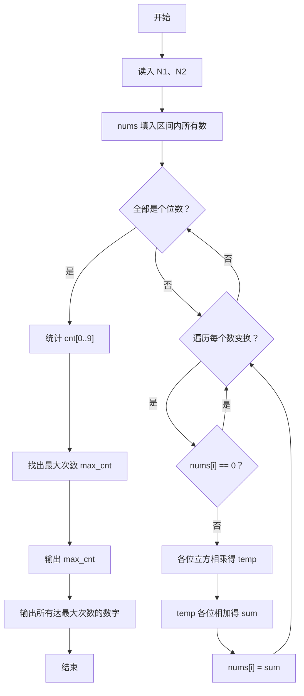
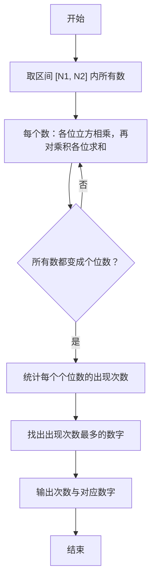

# 1117 数字之王 详解

### 解题思路

- 题目要求对区间 [N1, N2] 中的每个数反复进行一种变换：先把各位数字分别立方再相乘得到乘积 temp，再把 temp 的各位数字相加得到新数，直到区间内所有数都变成个位数。
- 变换一定会收敛：每轮变换后数字规模大幅缩减（立方乘积再求各位和），最终所有数都会变成 0~9 中的个位数。
- 外层 while(1) 循环先检查是否全部为个位数（有任一数字 ≥ 10 则继续变换），再对每个非零数字执行一轮变换；注意数字 0 直接跳过（0 的任何变换仍是 0，不会影响结果）。
- 变换实现：内层 while 按位取 `d = num % 10`，累乘 `d*d*d`；对乘积 temp 再按位累加得 sum，即为本轮新值。
- 收敛后统计 0~9 各数字出现次数 cnt[10]，找出最大次数 max_cnt，并把所有达到最大次数的数字按升序、空格分隔输出。
- 时间复杂度：每轮变换每个数字代价 O(位数)，轮数不多，总开销很小。

### 代码流程说明

1. 读入区间端点 N1、N2，计算区间长度 len，把 N1..N2 依次填入数组 nums。
2. 进入 while(1) 变换循环：先扫描 nums 检查是否全部小于 10，是则 break 结束变换。
3. 否则对每个 nums[i]（0 跳过）：while 循环逐位取数字 d，累乘 d 的立方得到 temp；再对 temp 逐位求和得到 sum；将 nums[i] 更新为 sum。
4. 变换结束后统计 cnt[0..9] 各数字出现次数，并求出最大值 max_cnt。
5. 先输出 max_cnt，再输出所有 cnt[i] == max_cnt 的数字（数字间空格分隔），最后换行。

### 代码流程图

### 解题流程图

