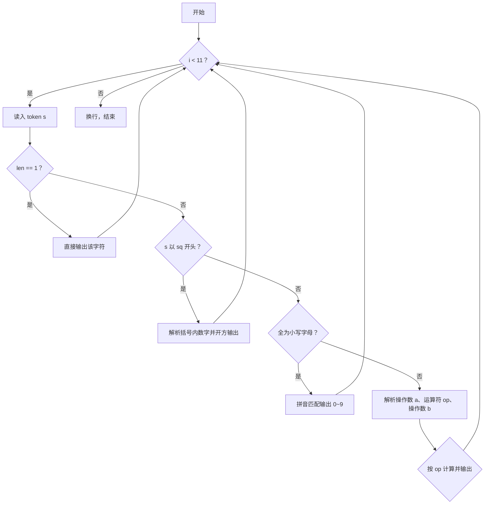
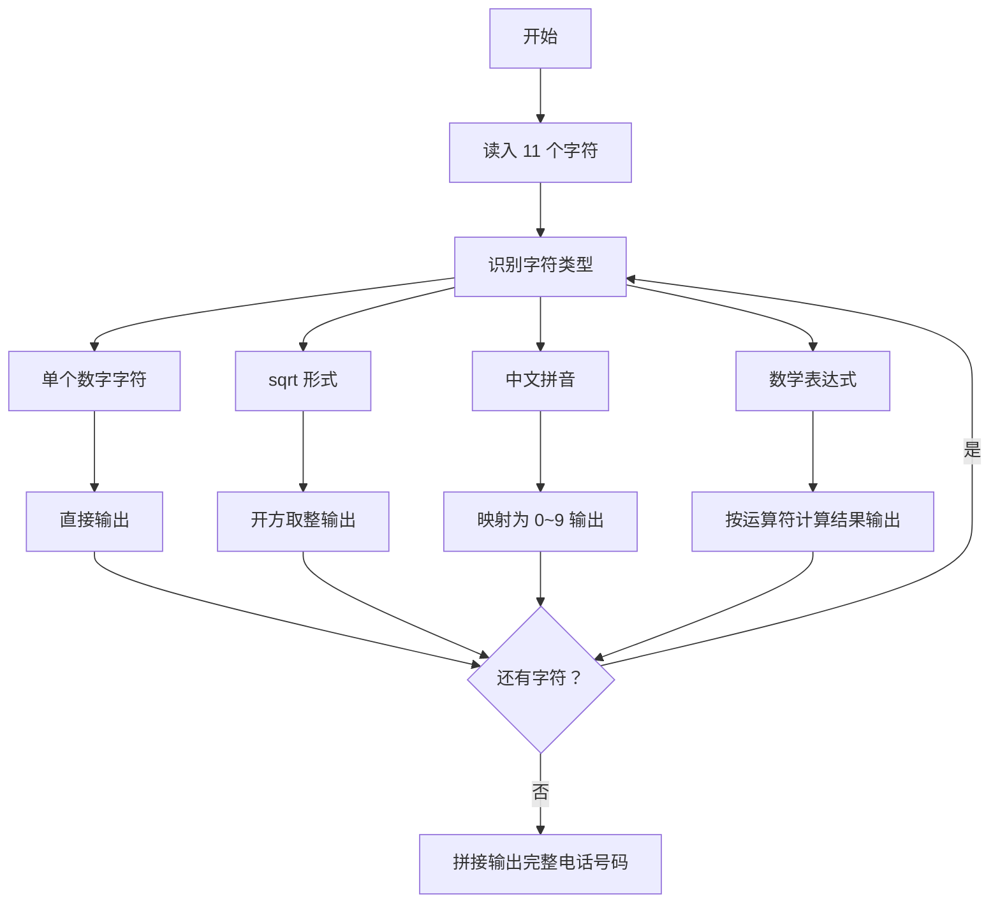

# 1118 如需挪车请致电 详解

### 解题思路

- 题目要求把 11 个"字符"（实际为字符串 token）转换为电话号码数字，转换规则随 token 形式不同而不同，属于分类处理题。
- token 分为四类，按特征区分：单个字符（长度 1）直接输出；以 "sq" 开头的是 `sqrt(x)` 平方根形式；全为小写字母的是中文数字拼音（ling~jiu）；其余是形如 "a op b" 的数学表达式。
- 平方根解析：字符串形如 "sqrt(N)"，数字从下标 4 开始取到末尾，转成整数后开方取整输出。
- 拼音转换：用 strcmp 与 "ling"~"jiu" 十个拼音逐一比对，命中即输出对应数字 0~9。
- 表达式解析：先连续读数字字符得到操作数 a，接着读一个运算符 op，再读剩余数字得到 b，最后按 +、−、×、÷、%、^ 六种运算符计算结果输出。
- 所有 11 个 token 依次处理后拼成一个电话号码串，最后换行。
- 时间复杂度 O(11 × 平均 token 长度)，开销恒定。

### 代码流程说明

1. for 循环执行 11 次：每次 `scanf("%s", s)` 读入一个 token，并取其长度 len。
2. 若 len == 1，直接 `printf("%c", s[0])`。
3. 否则若 s[0] == 's' 且 s[1] == 'q'，判定为 sqrt(x)：从下标 4 开始逐字符解析括号内数字得到 num，输出 `(int)sqrt(num)`。
4. 否则先检查 is_pinyin：若字符串全由小写字母组成，则用 strcmp 匹配 ling、yi、er、san、si、wu、liu、qi、ba、jiu，输出对应数字。
5. 不是拼音则是数学表达式：先解析第一个操作数 a，再取运算符 op，再解析第二个操作数 b，按 op 的取值分别计算加、减、乘、除、取模、幂并输出结果。
6. 11 个 token 全部处理完毕后输出换行。

### 代码流程图

### 解题流程图

