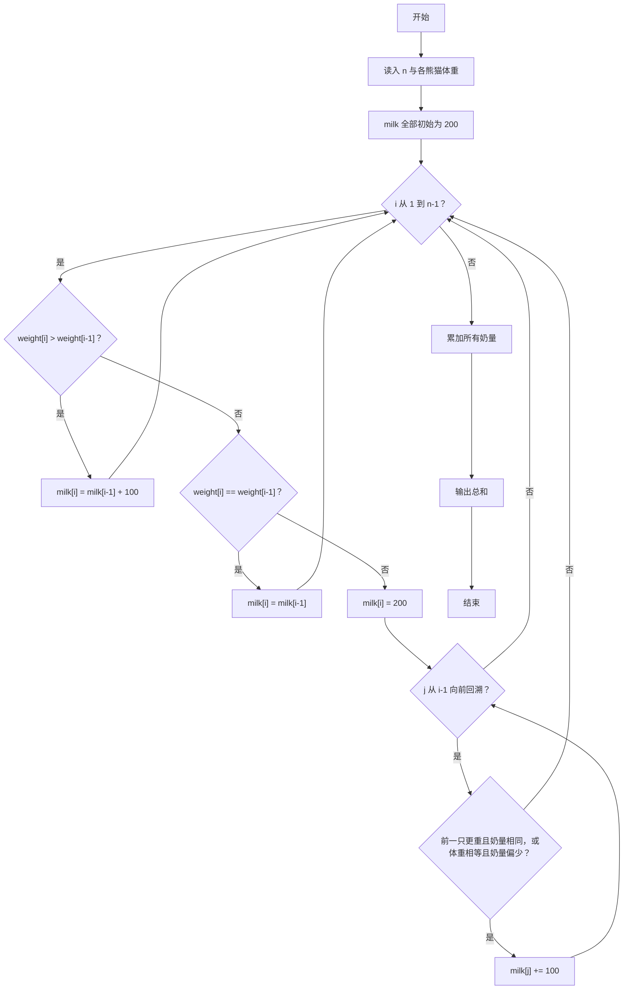
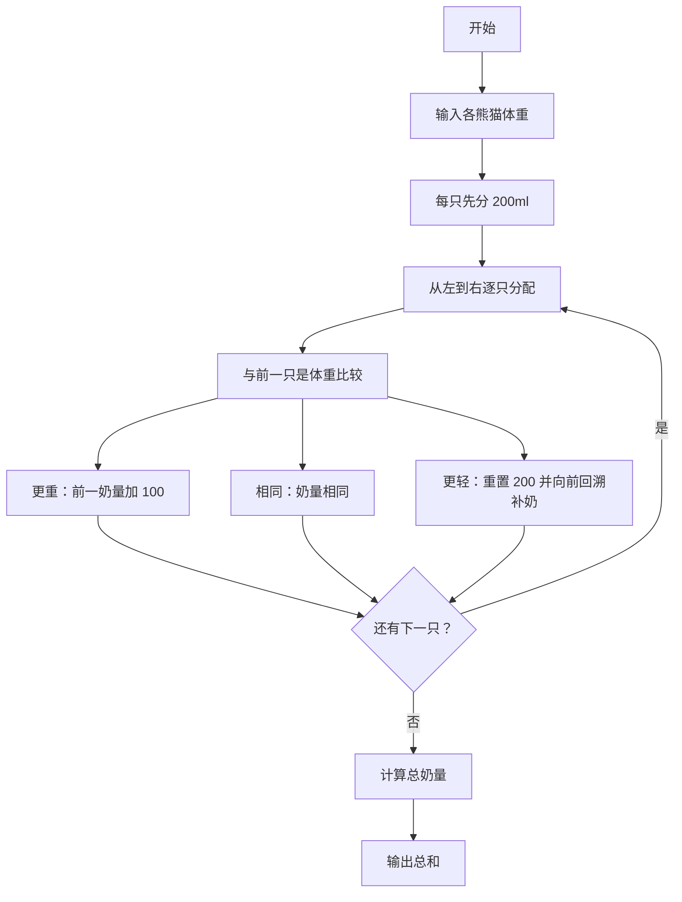

# 1119 胖达与盆盆奶 详解

### 解题思路

- 题目要求给排成一排的熊猫分奶，规则要点：每只先给 200ml 打底；体重比前一只重则多 100ml；体重相等则与前一只相同；体重比前一只轻则重置为 200ml，但可能引起"前面的熊猫显得不公平"，需要向前回溯补奶。
- 回溯补奶规则：若前一只更重（weight[j] > weight[j+1]）但奶量却与后一只相同，前一只需加 100ml；若体重相等但前一只奶量比后一只少，前一只也加 100ml；一旦不满足这两种情况就停止回溯。
- 核心思想是"局部修正的贪心 + 回溯"：从左到右确定奶量，只在体重下降（当前 200ml 可能低于前面的需求）时向前修正，保证相邻两只熊猫的奶量始终符合体重规则。
- 数据结构：weight 数组存体重，milk 数组存奶量，全部初始化为 200。
- 最后把所有奶量累加输出总和。
- 时间复杂度：最坏情况下回溯可能重复修正，为 O(n²)，但每个回溯点通常很快终止，n ≤ 10⁴ 时可接受。

### 代码流程说明

1. 读入熊猫数量 n，再读入 n 只熊猫的体重存入 weight 数组。
2. 初始化 milk 数组每只为 200。
3. 从 i = 1 到 n−1 逐只确定奶量：
   - 若 weight[i] > weight[i−1]：milk[i] = milk[i−1] + 100；
   - 若体重相等：milk[i] = milk[i−1]；
   - 若体重更轻：milk[i] = 200，然后从 j = i−1 向前回溯：满足 `weight[j] > weight[j+1] && milk[j] == milk[j+1]` 或 `weight[j] == weight[j+1] && milk[j] < milk[j+1]` 时 milk[j] 加 100，否则 break。
4. 全部确定后，for 循环累加 milk 得到 total，输出 total。

### 代码流程图

### 解题流程图

