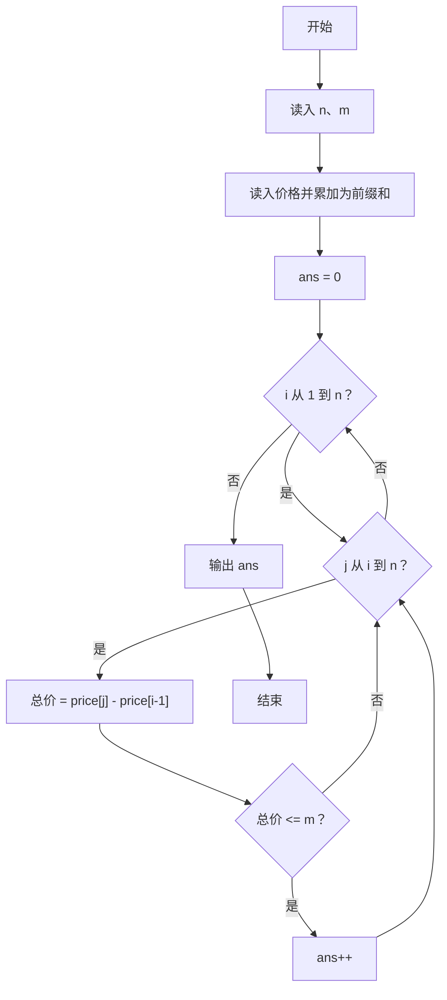
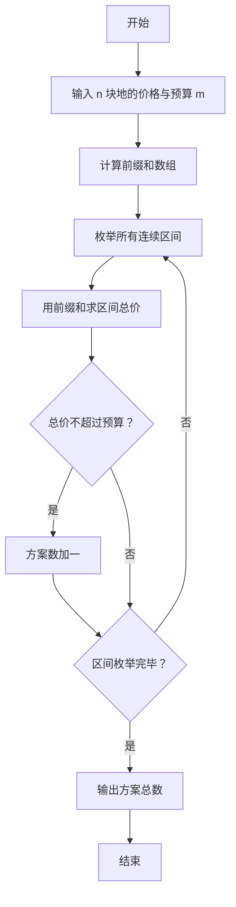

# 1120 买地攻略 详解

### 解题思路

- 题目要求统计有多少种"买地方案"：从连续排列的 n 块地中选一段连续区间，其价格总和不超过预算 m。
- 直接暴力枚举每个区间的起点 i 与终点 j 并累加求和是 O(n³)，利用前缀和可把区间和降到 O(1) 查询，整体降到 O(n²)。
- 前缀和定义：`price[i]` 表示前 i 块地价格之和，读入时边读边累加得到。
- 区间 [i, j] 的总价 = `price[j] - price[i-1]`，判断是否 ≤ m，是则 ans 加一。
- 枚举所有起点 i（1..n）与终点 j（i..n）即覆盖所有连续区间，天然不重不漏。
- 时间复杂度 O(n²)，n ≤ 10⁴ 时在题目时间限制内可行。

### 代码流程说明

1. 读入土地数量 n 与预算 m。
2. 读入 n 块土地价格：`scanf("%d", &price[i])` 后立刻执行 `price[i] += price[i-1]`，使 price 成为前缀和数组（price[1..n] 有效）。
3. ans 初始为 0；双重 for 循环：外层起点 i 从 1 到 n，内层终点 j 从 i 到 n。
4. 每对 (i, j) 计算 `price[j] - price[i-1]`，若不超过 m 则 ans 加一。
5. 循环结束后输出 ans。

### 代码流程图

### 解题流程图

