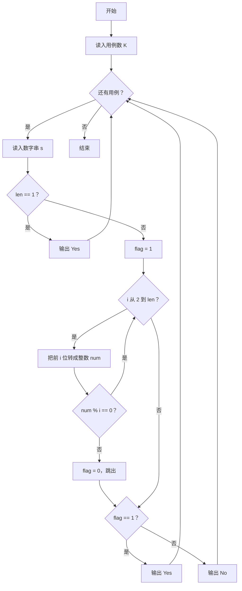
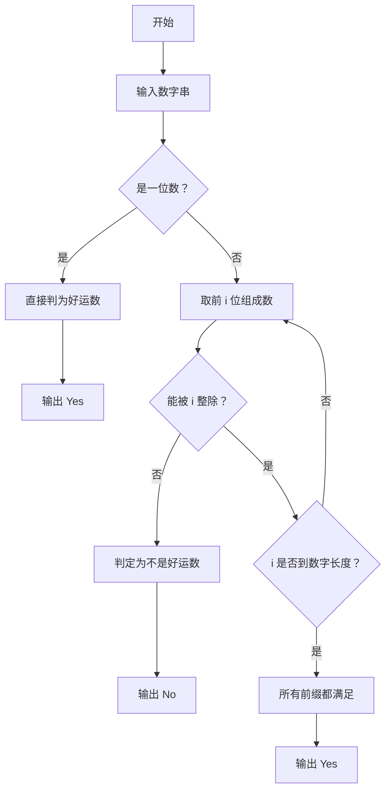

# 1121 祖传好运 详解

### 解题思路

- 题目定义"祖传好运"数：对数字的前 i 位（i 从 1 到 len），前 i 位组成的数都能被 i 整除。
- 一位数天然满足条件（1 % 1 == 0），可直接输出 "Yes"，无需进入判断循环。
- 判断方法：对每个 i（从 2 到 len），把字符串前 i 个字符逐位累加成整数 num，检查 `num % i == 0`；一旦某一位不整除就置 flag 为 0 并提前结束。
- 用字符串读入数字而非整数，可以避免大数溢出，也方便截取任意长度的前缀。
- 时间复杂度 O(len²)：每个 i 都要重新把前 i 位转成整数。

### 代码流程说明

1. 读入测试用例个数 K，进入 while(K--) 循环。
2. 每次读入数字串 s，取长度 len。
3. 若 len == 1，直接输出 "Yes" 并 continue。
4. 置 flag = 1；for 循环 i 从 2 到 len：内层 j 从 0 到 i−1 把前 i 个字符逐位拼成整数 num，若 `num % i != 0` 则 flag 置 0 并 break。
5. 按 flag 输出 "Yes" 或 "No"。

### 代码流程图

### 解题流程图

