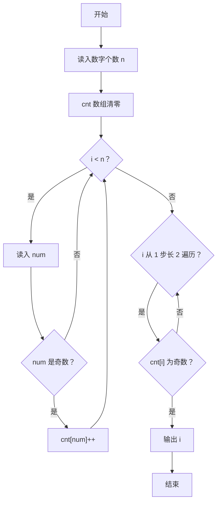
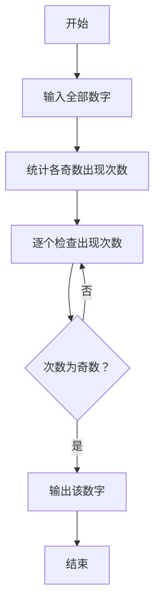

# 1122 找奇葩 详解

### 解题思路

- 题目保证：所有输入数字都是奇数，其中恰好一个数字出现奇数次，其余数字都出现偶数次，要求找出这个"奇葩"。
- 用计数数组 cnt 统计每个数出现的次数，数字范围有限（上限约 10⁵），可直接以数字本身为下标。
- 读入时只对奇数计数（`num % 2 == 1`），偶数忽略，符合题目"都是奇数"的约定。
- 查找阶段从 1 开始、步长为 2 只遍历奇数下标，第一个 `cnt[i] % 2 == 1` 的 i 即为答案，输出后结束。
- 本质是"奇偶性统计"问题；由于只有一个数出现奇数次，结果唯一。
- 时间复杂度 O(n + 值域)，空间复杂度 O(值域)。

### 代码流程说明

1. 读入数字个数 n，cnt 数组初始全 0。
2. for 循环读入每个数 num：若 num 为奇数则 cnt[num]++。
3. 遍历 i 从 1 到 MAX_VAL，步长 2：若 `cnt[i] % 2 == 1`，输出 i 并 break。

### 代码流程图

### 解题流程图

