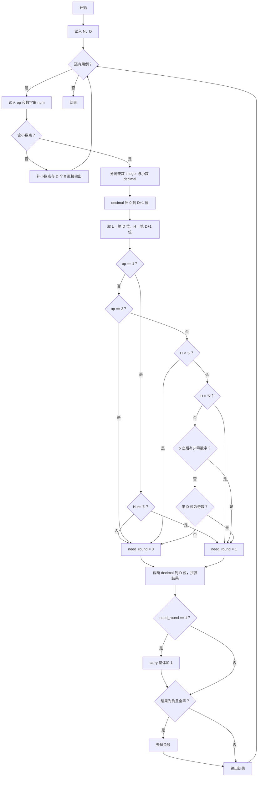
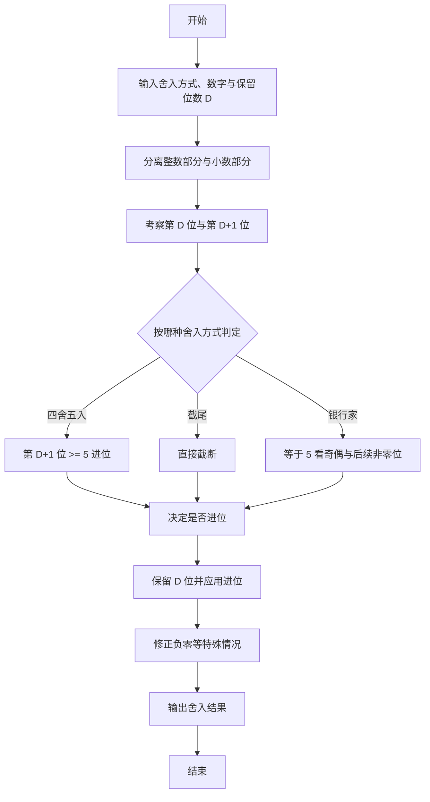

# 1123 舍入 详解

### 解题思路

- 题目要求对一个十进制数串按三种方式之一舍入到 D 位小数：四舍五入（op=1）、截尾（op=2）、银行家舍入（op=3），全程用字符串处理避免精度问题。
- 三种舍入的判断只依赖两个关键位：保留的最后一位 L（第 D 位）与被舍去部分的最高位 H（第 D+1 位）。
  - 四舍五入：H ≥ '5' 进位；
  - 截尾：一律不进位；
  - 银行家舍入：H < '5' 不进位、H > '5' 进位、H 恰为 '5' 时再看第 D 位的奇偶（奇数进位、偶数不进位）以及 '5' 之后是否还有非零数字（有则进位）。
- 无小数点的数字直接补 "。" + D 个 0 输出，不参与舍入逻辑。
- 进位处理由独立的 carry 函数完成：对数字串整体加 1，跳过小数点逐位传递进位，最高位溢出时在串首插入 '1'。
- 特殊处理：结果为 "-0.000..." 时去掉负号，避免输出非规范结果。
- 时间复杂度 O(数字长度)，每个用例都只做常数次扫描。

### 代码流程说明

1. 读入用例数 N 与保留位数 D，进入 while(N--) 循环。
2. 读入舍入方式 op 与数字串 num，用 strchr 查找小数点：
   - 无小数点：结果 = num + "." + D 个 '0'，直接输出并 continue。
3. 用 strncpy 分离整数部分 integer 与小数部分 decimal；把 decimal 补 '0' 到 D+1 位，保证 L、H 始终可取。
4. 取 `L = decimal[D-1]`、`H = decimal[D]`，按 op 计算 need_round（进位标记）：
   - op=1：H ≥ '5' 时进位；
   - op=2：不进位；
   - op=3：按"H 与 5 比较 + 奇偶 + 5 后非零位"规则判定。
5. 把 decimal 截断到 D 位（decimal[D] = '\0'），拼成 res = "整数.小数"。
6. 若 need_round 为真，调用 carry(res) 对整体加 1。
7. 若 res 以 '-' 开头且去掉符号后全为 0（或小数点），用 memmove 去掉负号；最后输出 res。

### 代码流程图

### 解题流程图

