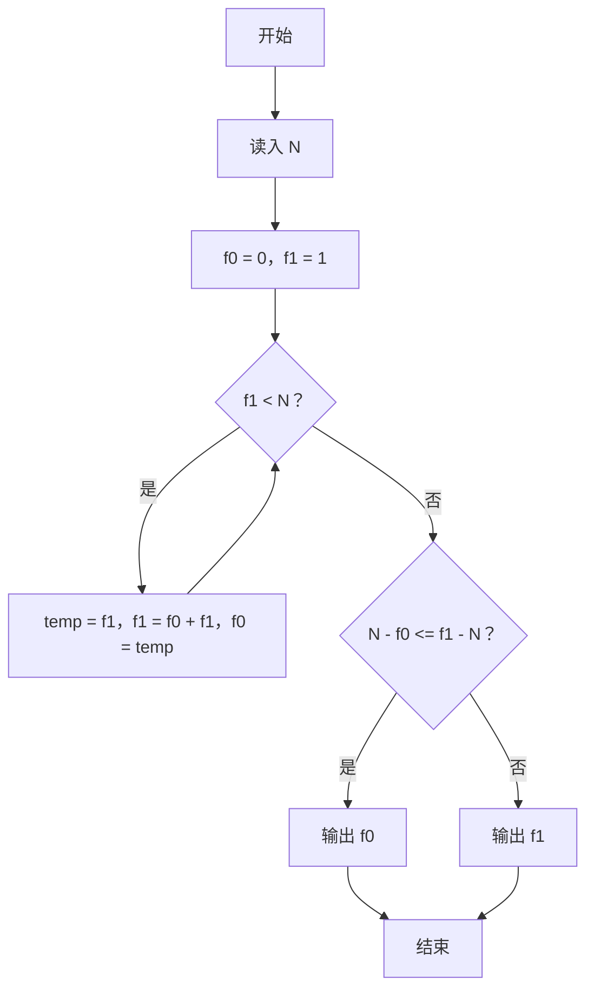
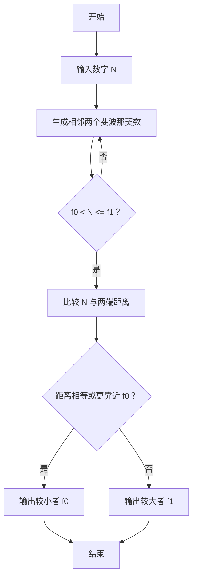

# 1124 最近的斐波那契数 详解

### 解题思路

- 题目要求找出与给定数 N 最接近的斐波那契数；若两个斐波那契数与 N 距离相等，取较小的那个。
- 斐波那契数列单调递增（从 F(0)=0、F(1)=1 开始），因此只需用两个相邻项 f0、f1 滚动逼近 N，停在 f0 < N ≤ f1 的位置即可，此时 N 的最近邻必在 f0 与 f1 之间。
- 滚动技巧：每次迭代用 `temp = f1; f1 = f0 + f1; f0 = temp` 前进一项，开销 O(log N)（斐波那契数按指数增长）。
- 收敛判定：f1 < N 时继续迭代，循环结束后比较 `N - f0` 与 `f1 - N` 两个距离。
- 平局处理：`N - f0 <= f1 - N` 时输出较小的 f0（题目要求距离相等取较小者）。
- 时间复杂度 O(log N)，空间复杂度 O(1)。

### 代码流程说明

1. 读入目标数 N，初始化 f0 = 0、f1 = 1。
2. while 循环条件 `f1 < N`：保存 temp = f1，更新 f1 = f0 + f1、f0 = temp，使两个相邻斐波那契数不断上移，直到 f1 ≥ N，此时 f0 < N ≤ f1。
3. 比较 `N - f0` 与 `f1 - N`：若前者不大于后者，输出 f0；否则输出 f1。

### 代码流程图

### 解题流程图

