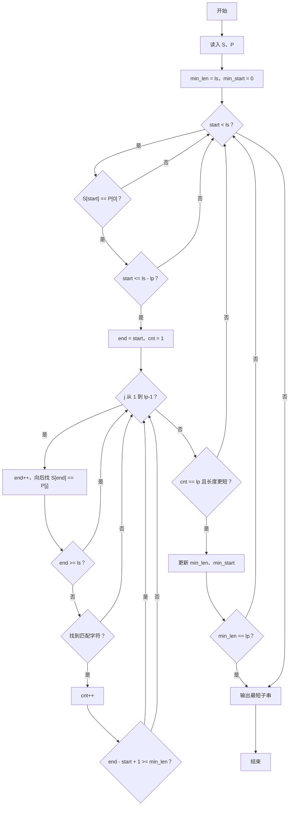
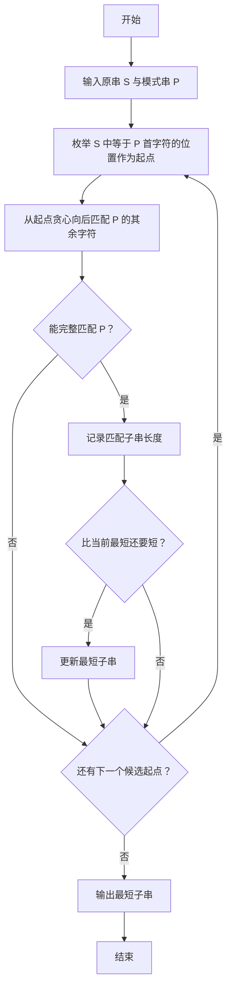

# 1125 子串与子列 详解

### 解题思路

- 题目要求在字符串 S 中找一个最短的连续子串，使得模式串 P 恰好是它的子序列（P 的字符按顺序出现，中间可夹杂其他字符）。
- 枚举起点策略：P 的首字符必须出现在子串中，所以只从 S 中等于 P[0] 的位置开始尝试。
- 匹配推进：从起点 start 出发，依次为 P 的第 2、3…个字符向后"贪心"找第一个匹配位置——越早匹配到，得到的子串越短，因此贪心正确。
- 剪枝优化：起点 start 若大于 ls − lp 则直接 break（剩余长度不足以容纳 P 作为子序列）；匹配过程中一旦 `end - start + 1 >= min_len` 即提前退出内层循环。
- 更新答案：只有完整匹配 P（cnt == lp）且长度更短时更新 min_len 与 min_start；若 min_len 已达到理论最短 lp 则整体提前结束。
- 最终从 min_start 起输出 min_len 个字符即所求最短子串。
- 时间复杂度最坏 O(ls × lp)，配合剪枝实际运行更快。

### 代码流程说明

1. 读入字符串 S 与模式串 P，取得长度 ls、lp；min_len 初始化为 ls，min_start 为 0。
2. 外层 for 枚举起点 start：
   - 若 `S[start] != P[0]` 跳过；若 `start > ls - lp` 直接 break。
   - 初始化 end = start、cnt = 1（已匹配 P 的首字符）。
3. 内层 for 匹配 P[1..lp-1]：end 自增后 while 循环向后找 S[end] == P[j]；越界则失败退出；找到则 cnt++，并检查 `end - start + 1 >= min_len` 提前退出。
4. 若 `cnt == lp` 且 `end - start + 1 < min_len`，更新最短长度与起点；若 min_len == lp 则 break 结束整个查找。
5. 按 min_start 与 min_len 输出最短子串，换行。

### 代码流程图

### 解题流程图

