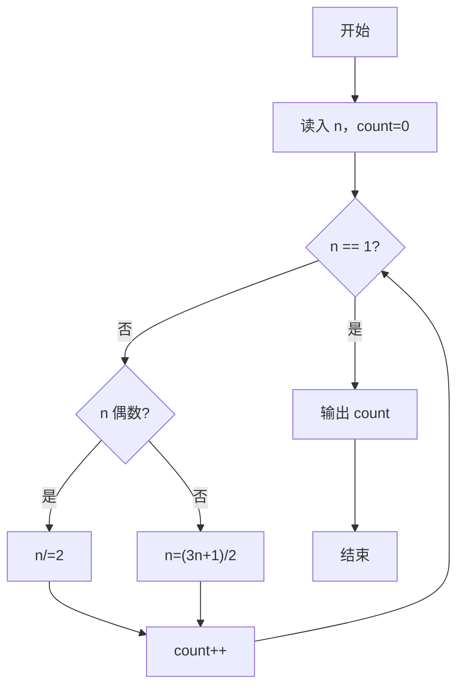

# PAT Basic Level Practice / PAT 乙级题解

> 浙江大学 PAT（Programming Ability Test）乙级 1001–1125 共 125 题，多语言完整题解仓库。覆盖 C / C++ / Python / Java / Go / Lua / Perl / Ruby / R / 仓颉（Cangjie）及 Markdown 题干存档，每题均含题目描述与可直接提交的源码实现。

[](https://pintia.cn/problem-sets/994805260223102976/exam/overview)
[-brightgreen)](#题目列表)
[](#多语言实现)
[](#许可)

---

## 项目简介

本仓库为 [PTA | 程序设计类实验辅助教学平台](https://pintia.cn/) 上 **PAT 乙级（Basic Level）** 的系统化题解集合。

- **题量完整**：收录 `1001` 至 `1125` 全部 125 题，无遗漏、编号连续。
- **多语言对照**：同一道题提供最多 10 种编程语言的实现，便于对比学习、跨语言刷题或教学演示。
- **开箱即用**：每份源码均从 `stdin` 读入、向 `stdout` 输出，符合 PAT 判题要求，可直接提交。
- **文档完备**：每题附带 Markdown 题干（含时间/内存限制、输入输出格式、样例），C 语言版本额外提供 `题目详解.md`（解题思路 + 流程图）。

> 远程仓库：`git@github.com:Zonkidd-Shao/pta_basic_level_practice.git`

---

## 仓库亮点

- **注释详尽**：源码头部均包含题目、实现原理、算法思路、复杂度分析（以 `PAT_Basic_Level_by_c/1001 害死人不偿命的(3n+1)猜想/1001 害死人不偿命的(3n+1)猜想.c:1-25` 为例）。
- **图解辅助**：C 语言 `题目详解.md` 中使用 Mermaid `flowchart` 绘制代码流程图与解题流程图，便于理解。
- **统一目录**：`{题号} {题名}/` 二级目录，检索直观，脚本批量处理友好。
- **纯净题干**：`PAT_Basic_Level_by_markdown/` 仅存题干 Markdown，可作为离线题库或二次加工数据源。

---

## 目录结构

```
PAT_Basic_Level/
├── PAT_Basic_Level_by_c/          # C 语言题解（125 题，每题含 .c + .md + 题目详解.md）
├── PAT_Basic_Level_by_cpp/        # C++ 题解（.cpp + .md）
├── PAT_Basic_Level_by_py3/        # Python 3 题解（.py + .md）
├── PAT_Basic_Level_by_java/       # Java 题解（.java + .md）
├── PAT_Basic_Level_by_go/         # Go 题解（.go + .md）
├── PAT_Basic_Level_by_lua/        # Lua 题解（.lua + .md）
├── PAT_Basic_Level_by_perl/       # Perl 题解（.pl + .md）
├── PAT_Basic_Level_by_ruby/       # Ruby 题解（.rb + .md）
├── PAT_Basic_Level_by_r/          # R 题解（.R + .md）
├── PAT_Basic_Level_by_cjc/        # 仓颉 Cangjie 题解（.cj + .md）
├── PAT_Basic_Level_by_markdown/   # 纯题干 Markdown 存档（125 篇）
└── README.md
```

单题目录示例（以 `1001` 为例）：

```
PAT_Basic_Level_by_c/1001 害死人不偿命的(3n+1)猜想/
├── 1001 害死人不偿命的(3n+1)猜想.c   # 可提交源码
├── 1001 害死人不偿命的(3n+1)猜想.md  # 题干（含限制、样例）
└── 题目详解.md                      # 仅 C 目录有：思路、复杂度、Mermaid 流程图

PAT_Basic_Level_by_py3/1001 害死人不偿命的(3n+1)猜想/
├── 1001 害死人不偿命的(3n+1)猜想.py
└── 1001 害死人不偿命的(3n+1)猜想.md
```

> 统计：11 个顶级目录 × 125 题 = 1375 个子目录；源码文件约 1250+，总文件数超 2700。

---

## 多语言实现

| 目录 | 语言 | 扩展名 | 题数 | 备注 |
|------|------|--------|------|------|
| `PAT_Basic_Level_by_c` | C (C11) | `.c` | 125 | 含 `题目详解.md`，注释最详 |
| `PAT_Basic_Level_by_cpp` | C++ (C++17) | `.cpp` | 125 | 面向对象/STL 写法 |
| `PAT_Basic_Level_by_py3` | Python 3 | `.py` | 125 | `sys.stdin` 读取，简洁实现 |
| `PAT_Basic_Level_by_java` | Java | `.java` | 125 | `Scanner`/`BufferedReader` |
| `PAT_Basic_Level_by_go` | Go | `.go` | 125 | `bufio.Scanner` |
| `PAT_Basic_Level_by_lua` | Lua | `.lua` | 125 | Lua 5.x |
| `PAT_Basic_Level_by_perl` | Perl | `.pl` | 125 | `strict`/`warnings` |
| `PAT_Basic_Level_by_ruby` | Ruby | `.rb` | 125 | Ruby 3.x |
| `PAT_Basic_Level_by_r` | R | `.R` | 125 | Rscript 可执行 |
| `PAT_Basic_Level_by_cjc` | 仓颉 Cangjie | `.cj` | 125 | 华为仓颉 `cjc` |
| `PAT_Basic_Level_by_markdown` | Markdown | `.md` | 125 | 仅题干，无代码 |

---

## 题目列表

> 1001–1125 共 125 题，编号连续。点击对应目录即可查看多语言实现。

<details>
<summary>展开查看完整题单（125 题）</summary>

| 题号 | 题名 | 题号 | 题名 | 题号 | 题名 |
|------|------|------|------|------|------|
| 1001 | 害死人不偿命的(3n+1)猜想 | 1002 | 写出这个数 | 1003 | 我要通过！ |
| 1004 | 成绩排名 | 1005 | 继续(3n+1)猜想 | 1006 | 换个格式输出整数 |
| 1007 | 素数对猜想 | 1008 | 数组元素循环右移问题 | 1009 | 说反话 |
| 1010 | 一元多项式求导 | 1011 | A+B 和 C | 1012 | 数字分类 |
| 1013 | 数素数 | 1014 | 福尔摩斯的约会 | 1015 | 德才论 |
| 1016 | 部分A+B | 1017 | A除以B | 1018 | 锤子剪刀布 |
| 1019 | 数字黑洞 | 1020 | 月饼 | 1021 | 个位数统计 |
| 1022 | D进制的A+B | 1023 | 组个最小数 | 1024 | 科学计数法 |
| 1025 | 反转链表 | 1026 | 程序运行时间 | 1027 | 打印沙漏 |
| 1028 | 人口普查 | 1029 | 旧键盘 | 1030 | 完美数列 |
| 1031 | 查验身份证 | 1032 | 挖掘机技术哪家强 | 1033 | 旧键盘打字 |
| 1034 | 有理数四则运算 | 1035 | 插入与归并 | 1036 | 跟奥巴马一起编程 |
| 1037 | 在霍格沃茨找零钱 | 1038 | 统计同成绩学生 | 1039 | 到底买不买 |
| 1040 | 有几个PAT | 1041 | 考试座位号 | 1042 | 字符统计 |
| 1043 | 输出PATest | 1044 | 火星数字 | 1045 | 快速排序 |
| 1046 | 划拳 | 1047 | 编程团体赛 | 1048 | 数字加密 |
| 1049 | 数列的片段和 | 1050 | 螺旋矩阵 | 1051 | 复数乘法 |
| 1052 | 卖个萌 | 1053 | 住房空置率 | 1054 | 求平均值 |
| 1055 | 集体照 | 1056 | 组合数的和 | 1057 | 数零壹 |
| 1058 | 选择题 | 1059 | C语言竞赛 | 1060 | 爱丁顿数 |
| 1061 | 判断题 | 1062 | 最简分数 | 1063 | 计算谱半径 |
| 1064 | 朋友数 | 1065 | 单身狗 | 1066 | 图像过滤 |
| 1067 | 试密码 | 1068 | 万绿丛中一点红 | 1069 | 微博转发抽奖 |
| 1070 | 结绳 | 1071 | 小赌怡情 | 1072 | 开学寄语 |
| 1073 | 多选题常见计分法 | 1074 | 宇宙无敌加法器 | 1075 | 链表元素分类 |
| 1076 | Wifi密码 | 1077 | 互评成绩计算 | 1078 | 字符串压缩与解压 |
| 1079 | 延迟的回文数 | 1080 | MOOC期终成绩 | 1081 | 检查密码 |
| 1082 | 射击比赛 | 1083 | 是否存在相等的差 | 1084 | 外观数列 |
| 1085 | PAT单位排行 | 1086 | 就不告诉你 | 1087 | 有多少不同的值 |
| 1088 | 三人行 | 1089 | 狼人杀-简单版 | 1090 | 危险品装箱 |
| 1091 | N-自守数 | 1092 | 最好吃的月饼 | 1093 | 字符串A+B |
| 1094 | 谷歌的招聘 | 1095 | 解码PAT准考证 | 1096 | 大美数 |
| 1097 | 矩阵行平移 | 1098 | 岩洞施工 | 1099 | 性感素数 |
| 1100 | 校庆 | 1101 | 兔子跳 | 1102 | 教超冠军卷 |
| 1103 | 缘分数 | 1104 | 天长地久 | 1105 | 链表合并 |
| 1106 | 2019数列 | 1107 | 老鼠爱大米 | 1108 | String复读机 |
| 1109 | 擅长C | 1110 | 区块反转 | 1111 | 对称日 |
| 1112 | 超标区间 | 1113 | 钱串子的加法 | 1114 | 全素日 |
| 1115 | 裁判机 | 1116 | 新生舞会 | 1117 | 艾丁顿数（升级版） |
| 1118 | 围观人数 | 1119 | 胖达与盆盆奶 | 1120 | 买地攻略 |
| 1121 | 子串变位 | 1122 | 超能力者 | 1123 | 舍入 |
| 1124 | 最近的斐波那契数 | 1125 | 链表排序 |  |  |

</details>

题干格式统一（示例 `PAT_Basic_Level_by_c/1001 害死人不偿命的(3n+1)猜想/1001 害死人不偿命的(3n+1)猜想.md:1-32`）：

```markdown
# 1001 害死人不偿命的(3n+1)猜想
**时间限制**: 400 ms
**内存限制**: 65536 KB
...
### 输入格式：
### 输出格式：
### 输入样例：
### 输出样例：
```

---

## 快速开始

### 克隆仓库

```bash
git clone git@github.com:Zonkidd-Shao/pta_basic_level_practice.git
cd pta_basic_level_practice   # 即 PAT_Basic_Level
```

### 按语言运行（以 1001 题为例）

```bash
# C
gcc "PAT_Basic_Level_by_c/1001 害死人不偿命的(3n+1)猜想/1001 害死人不偿命的(3n+1)猜想.c" -o /tmp/a.out && echo 3 | /tmp/a.out
# => 5

# C++
g++ "PAT_Basic_Level_by_cpp/1001 害死人不偿命的(3n+1)猜想/1001 害死人不偿命的(3n+1)猜想.cpp" -o /tmp/a.out && echo 3 | /tmp/a.out

# Python
echo 3 | python3 "PAT_Basic_Level_by_py3/1001 害死人不偿命的(3n+1)猜想/1001 害死人不偿命的(3n+1)猜想.py"

# Java
javac "PAT_Basic_Level_by_java/1001 害死人不偿命的(3n+1)猜想/1001 害死人不偿命的(3n+1)猜想.java" -d /tmp && echo 3 | java -cp /tmp Main

# Go
echo 3 | go run "PAT_Basic_Level_by_go/1001 害死人不偿命的(3n+1)猜想/1001 害死人不偿命的(3n+1)猜想.go"

# Lua
echo 3 | lua "PAT_Basic_Level_by_lua/1001 害死人不偿命的(3n+1)猜想/1001 害死人不偿命的(3n+1)猜想.lua"

# Perl
echo 3 | perl "PAT_Basic_Level_by_perl/1001 害死人不偿命的(3n+1)猜想/1001 害死人不偿命的(3n+1)猜想.pl"

# Ruby
echo 3 | ruby "PAT_Basic_Level_by_ruby/1001 害死人不偿命的(3n+1)猜想/1001 害死人不偿命的(3n+1)猜想.rb"

# R
echo 3 | Rscript "PAT_Basic_Level_by_r/1001 害死人不偿命的(3n+1)猜想/1001 害死人不偿命的(3n+1)猜想.R"

# 仓颉 Cangjie
cjc "PAT_Basic_Level_by_cjc/1001 害死人不偿命的(3n+1)猜想/1001 害死人不偿命的(3n+1)猜想.cj" -o /tmp/cj.out && echo 3 | /tmp/cj.out
```

> 批量验证（示例：统计 Python 是否均可执行）：
> ```bash
> for d in PAT_Basic_Level_by_py3/*/; do python3 -m py_compile "$d"/*.py || echo "fail: $d"; done
> ```

### 在 PTA 上提交

直接复制对应语言目录下的源码文件内容，粘贴至 [PTA 提交页](https://pintia.cn/problem-sets/994805260223102976/problems/type/7) 选择对应编译器提交即可。

---

## 代码规范与实现特点

- **输入输出**：统一从标准输入读取、标准输出打印，兼容 PAT 判题的重定向与多组输入处理。
- **注释风格**：
  - C/Go/Perl 等在文件头部以块注释说明题目、知识点、算法与复杂度（`PAT_Basic_Level_by_perl/1001 害死人不偿命的(3n+1)猜想/1001 害死人不偿命的(3n+1)猜想.pl:1-30`）。
  - Python/Ruby 等在文件头部用行注释 + `import` 后紧跟核心逻辑（`PAT_Basic_Level_by_py3/1001 害死人不偿命的(3n+1)猜想/1001 害死人不偿命的(3n+1)猜想.py:1-29`）。
- **复杂度标注**：多数实现在注释中给出时间/空间复杂度（如 `O(n log n)`、`O(1)`）。
- **边界处理**：对空输入、非法输入、精度/溢出等 PAT 常见坑点做了防护（见 `1011 A+B 和 C`、`1024 科学计数法` 等）。

C 语言示例 `PAT_Basic_Level_by_c/1001 害死人不偿命的(3n+1)猜想/1001 害死人不偿命的(3n+1)猜想.c:12-24`：

```c
int main() {
    int n, count = 0;
    scanf("%d", &n);
    while (n != 1) {
        if (n % 2 == 0) n /= 2;
        else n = (3 * n + 1) / 2;
        count++;
    }
    printf("%d\n", count);
    return 0;
}
```

---

## 题目详解（C 语言）

`PAT_Basic_Level_by_c/*/题目详解.md` 为每题的精讲文档，包含：

- **解题思路**：数据结构选型、关键公式/贪心/模拟要点
- **代码流程说明**：分步骤对应源码行
- **复杂度分析**
- **Mermaid 流程图**：代码流程图 + 解题流程图（可在 GitHub / Typora 中直接渲染）

示例摘自 `PAT_Basic_Level_by_c/1001 害死人不偿命的(3n+1)猜想/题目详解.md`：



---

## 适用人群

- 备考 PAT 乙级 / 考研复试 / 保研机试的学生
- 需要 **多语言对照** 学习数据结构与算法的初学者
- 授课教师：可直接用作作业题库、离线题干与参考答案

---

## 常见问题

**Q: 为什么有 11 个目录？`by_cjc` 是什么？**
`by_cjc` 为华为 **仓颉（Cangjie）** 语言实现（`.cj`），用于国产语言生态学习；`by_markdown` 为纯题干存档，便于离线阅读或生成 PDF。

**Q: 目录名含空格/中文，脚本如何处理？**
务必加引号：`cat "PAT_Basic_Level_by_c/1001 害死人不偿命的(3n+1)猜想/1001 害死人不偿命的(3n+1)猜想.c"`，或使用 `find ... -print0 | xargs -0`。

**Q: 提交后 WA/超时？**
对照 `题目详解.md` 检查边界与精度；C/C++/Python 已按 400 ms–600 ms 限制优化，Java/Go 注意快读快写。

---

## 贡献指南

欢迎提交 PR / Issue：

1. Fork 本仓库并新建分支 `fix/10xx-xxx`
2. 保持目录与文件名与现有规范一致（`{题号} {题名}/{题号} {题名}.{ext}` + `{题号} {题名}.md`）
3. 源码需包含头部注释（题目、思路、复杂度）并通过本地样例测试
4. 提交前执行 `git diff --stat` 确认仅修改预期文件

---

## 许可

本仓库题解代码建议采用 **MIT** 许可；题干内容版权归 PTA / 浙江大学所有，仅供学习交流使用。

---

## 致谢

- 浙江大学 PAT 命题组与 PTA 平台
- 所有参与多语言移植与详解撰写的贡献者

> 若本仓库对你有帮助，欢迎 Star ⭐ 支持！
